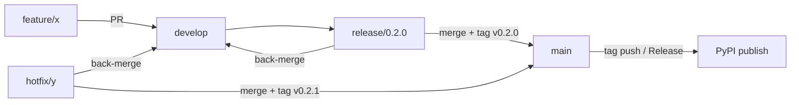

# Contributing to grag

Thanks for hacking on grag. This document describes the branching model, the PR
rules, and how a release gets cut and published to PyPI.

## Branching model — Gitflow-lite

Two long-lived branches, plus short-lived working branches.

| Branch          | Purpose                                                        | Lifetime    |
| --------------- | -------------------------------------------------------------- | ----------- |
| `main`          | Always releasable. Tags and PyPI releases are cut from here.    | permanent   |
| `develop`       | Integration branch. All features land here first.               | permanent   |
| `feature/<x>`   | A single feature or change. Branched from `develop`.            | until merged |
| `release/<x.y.z>` | Stabilize a release. Branched from `develop`.                 | until merged |
| `hotfix/<x>`    | Urgent fix against what's shipped. Branched from `main`.        | until merged |



### The rules

- **PRs required** for everything. No direct pushes to `main` or `develop`.
- **CI must be green** before merge (pytest matrix + ruff/mypy + UI build — see
  `.github/workflows/ci.yml`).
- **Squash-merge** `feature/*` into `develop` to keep history readable.
- **No force-push** to `main` or `develop`. Ever.
- Keep `feature/*` branches small and focused; one concern per PR.

### Where work goes

- Day-to-day work: branch `feature/<name>` **from `develop`**, PR back to
  `develop`.
- Preparing a release: cut `release/<x.y.z>` **from `develop`**. Only bug fixes
  and the version bump go here — no new features. Merge it to `main` (fast-forward
  or merge commit), tag `v<x.y.z>`, then **back-merge to `develop`** so the fixes
  and version bump don't get lost.
- Urgent production fix: branch `hotfix/<name>` **from `main`**, merge to `main`
  (tag a patch release), then **back-merge to `develop`**.

## Development setup

```bash
# Build the UI FIRST — pip install (editable or not) requires the built bundle
# to exist at src/grag/api/static (the wheel's force-include; see pyproject.toml).
cd ui && npm ci && npm run build && cd ..

python -m venv .venv && source .venv/bin/activate
pip install -e ".[dev]"
pytest                      # run the test suite
ruff check src tests        # lint (config pinned in pyproject.toml)
mypy src/grag               # type-check
```

grag targets **Python 3.10+** (CI tests 3.10–3.14). LadybugDB downloads its FTS
and VECTOR extensions on first use, so the first test run needs network access.

## Cutting a release

1. Make sure `develop` is green and cut `release/<x.y.z>`:
   `git checkout -b release/0.2.0 develop`
2. Bump `version` in `pyproject.toml` to `0.2.0` (the publish workflow **fails**
   if the tag doesn't match this value).
3. Merge `release/0.2.0` → `main`.
4. Tag it: `git tag v0.2.0 && git push origin main --tags`
   — pushing a `v*` tag **or** publishing a GitHub Release triggers the
   publish workflow (`.github/workflows/publish.yml`): build UI → pytest →
   build dist (`twine check`) → publish to PyPI via OIDC.
5. Back-merge `main` → `develop` and delete the release branch.

## One-time PyPI setup (maintainer)

Publishing uses **OIDC Trusted Publishing** — no long-lived API token is stored
in the repo. It has to be authorized once on PyPI:

The PyPI **distribution** name is `gragdb` (the bare `grag` name was already
taken by an unrelated placeholder project). The Python import package and the
CLI command are still `grag` — only the `pip install gragdb` label differs.

1. On [pypi.org](https://pypi.org) → the `gragdb` project → **Publishing** →
   add a **GitHub** trusted publisher with:
   - owner: `krokz`
   - repository: `grag`
   - workflow: `publish.yml`
   - environment: `pypi`
2. If the `gragdb` project name isn't registered on PyPI yet, use PyPI's
   **"pending publisher"** flow to pre-authorize the OIDC publisher before the
   first upload (the first trusted publish then creates the project). If that
   isn't available for a brand-new name on your account, do the **first**
   publish once with a one-time API token to claim the name, *then* configure
   the trusted publisher above.

Until step 1 is done the `publish` job will fail at the upload step; everything
before it (build, `twine check`) still validates the release.
