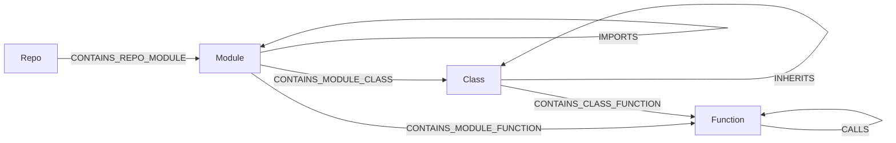

# grag

**Local-first, LLM-first graph knowledgebase.** One embedded Cypher engine ([LadybugDB](https://ladybugdb.com), the Kuzu successor), one file per database, zero daemons, nothing leaves your machine — wrapped in the tool contract LLMs actually need: schema introspection that anchors text-to-Cypher, idempotent upserts with provenance, hybrid FTS/vector search, and token-budgeted subgraph context for grounded, low-hallucination answers.

*(**G**(raph)**RAG** — retrieval-augmented generation grounded in a graph.)*

Not an enterprise platform. `pip install`, point an MCP client at it, done.

## Local-first, token-frugal

grag is built for **your** machine, not a server farm. Every developer runs their own `gragdb`, with each project's knowledge in its own `.lbdb` file. Your LLM queries *that* — locally, offline, no per-token API cost for retrieval — instead of re-reading your whole codebase every session.

The point isn't just "local storage," it's **token economics**:

- **Stop re-reading files.** An agent that greps and re-reads source every session burns thousands of tokens re-deriving structure it already knew. grag answers "what calls X / what imports Y / why did we choose Z" with a cheap Cypher or search call — tokens go to *reasoning*, not *re-discovery*.
- **Structure over bodies.** Code ingestion stores signatures, docstrings, and line ranges — never source bodies — so the graph stays tiny and queries resolve at near-zero body tokens. Fetch a body only when the graph points you at the exact `path:line_start-line_end`.
- **Token budgets everywhere.** `search_knowledge` / `get_context` return cited subgraphs packed to a budget you set, so grounding never floods the context window.
- **Context that compounds.** Decisions, conventions, and rationale the agent learns get written back (`upsert_nodes/edges` with provenance) and linked to the code they describe — so the next session starts from what you already established, not from scratch.
- **Local means private and free.** No external embedding service by default (optional local ONNX embeddings, no torch), no telemetry, no daemon. Your code and your knowledge stay on-disk, in a file you can copy, back up, or delete.

The result: an LLM that grounds its answers in *your* project's accumulated knowledge — with far fewer tokens, far less hallucination, and zero data leaving the box.

## Why a graph

LLM answers hallucinate when retrieval returns isolated chunks. grag stores knowledge as a **graph** — entities, documents, code, and their relationships — so retrieval returns a connected, cited subgraph an LLM can reason over, not a bag of fragments. And the LLM can *build* the graph itself: `define_schema` + `upsert_nodes/edges` are first-class tools, so "turn these docs (or this repo) into a knowledge graph" is a normal conversation, not a pipeline project.

## How grag differs

The space tends to split two ways: **code-graph extractors** (compile a repo into a graph artifact an assistant can traverse) and **enterprise graph platforms** (a server you operate, then bolt RAG on yourself). grag is the missing middle — an **embedded Cypher knowledgebase agents both build and retrieve from**, with hybrid search packed to a token budget. One `.lbdb` file per project, no daemon.

What that means in practice:

- **Writable memory, not just an extract.** Agents `define_schema` and upsert facts/decisions with `_source` provenance, so knowledge compounds across sessions instead of being re-derived every time.
- **Hybrid GraphRAG as the product surface.** BM25 + vectors → RRF → per-label diversity → k-hop expansion → cited context under a token budget (`search_knowledge` / `get_context`). Not a bag of chunks, not a bare Cypher driver.
- **Structure-only code indexing.** Signatures, docstrings, and line ranges — never source bodies. Fetch a file only when the graph points at the exact `path:line_start-line_end`.
- **MCP-shaped for self-correction.** Eight tools; `describe_schema` before Cypher so the model stops inventing labels; errors come back with hints.

Use an extractor when you want a one-shot map of a codebase. Use a graph platform when you need multi-user ops, clustering, or a shared server. Use grag when the agent should **accumulate** project knowledge locally and ground answers in a hybrid subgraph without standing up a database.

## Install

**From PyPI** (ships the web UI):

```bash
pip install gragdb
```

Python 3.10–3.14; **3.13 recommended** (faster interpreter for the Python-side
packing/serialization paths, and 3.10 reaches end-of-life in October 2026).

**From source** (for development). Build the UI **first** — `pip install` needs the
built bundle at `src/grag/api/static` (the wheel's force-include; see `pyproject.toml`):

```bash
cd ui && npm ci && npm run build && cd ..   # builds the UI into src/grag/api/static/
pip install -e .            # core: engine, REST, MCP, FTS — no torch, no GPU stack
pip install -e ".[dev]"     # tests
pip install -e ".[code]"          # optional: tree-sitter code parsing (ts/js/cs/tf)
pip install -e ".[embed-local]"   # optional: local embeddings (fastembed/ONNX, still no torch)
pip install -e ".[embed-remote]"  # optional: OpenAI-compatible remote embeddings
```

Without an embedder, everything works FTS-only (BM25 is native to the engine).

**Enabling semantic search:** install `embed-local`, then set `GRAG_EMBED_PROVIDER=fastembed`
when serving. This uses ONNX Runtime — **no PyTorch** — so grag stays light (~50-100MB,
model downloads once then works offline). Nodes are (re)embedded lazily on the next
search whenever their embedding is NULL. First query downloads the model + embeds all
nodes (seconds); steady state is ~300ms/query on CPU.

```bash
pip install -e ".[embed-local]"
GRAG_EMBED_PROVIDER=fastembed grag --db knowledge.lbdb serve
# optional: GRAG_EMBED_MODEL=BAAI/bge-base-en-v1.5 GRAG_EMBED_DIM=768
```

## Quickstart

```bash
# build the demo knowledgebase (fictional company handbook, entities + relations)
python examples/build_example.py

# serve REST + the graph UI at http://127.0.0.1:8471
# (note: start it from a normal terminal — servers launched inside an agent
# sandbox get torn down and can't be reached from your browser)
grag --db examples/knowledge.lbdb serve

# single-process mode: UI + REST + MCP on one live .lbdb (recommended for
# dogfooding — the UI sees MCP writes the moment they land)
grag --db examples/knowledge.lbdb serve --with-mcp
#   UI  → http://127.0.0.1:8471/
#   MCP → http://127.0.0.1:8471/mcp   (streamable-http; point MCP clients here)

# or answer 3 demo questions end-to-end in the terminal
python examples/demo_e2e.py
```

The UI: force-graph explorer (click = inspect, double-click = expand neighbors), Cypher console (Ctrl+Enter, graph/table results), schema sidebar, and a search bar that shows the exact grounding text an LLM would receive. **Click a label in the legend** (bottom-left) to view just that label and its 1-hop relationships — e.g. click `Decision` to see only your Decisions and what they document/motivate; run a query or reload to reset the canvas.

**One process, one live file.** LadybugDB is single-writer, so `serve` and `mcp` can't share a `.lbdb` as separate processes. `serve --with-mcp` mounts the MCP endpoint *inside* the REST/UI server, so UI + REST + MCP share one registry and one write connection — the UI watches the AI's writes land live instead of reading a stale copy. Use `--mcp-path` to change the MCP mount path (default `/mcp`).

## Use from an LLM harness (MCP)

```bash
grag --db knowledge.lbdb mcp
```

Cursor / `.cursor/mcp.json`:

```json
{
  "mcpServers": {
    "grag": {
      "command": "grag",
      "args": ["--db", "/absolute/path/knowledge.lbdb", "mcp"]
    }
  }
}
```

Any MCP client gets these 8 tools:

| tool | purpose |
|---|---|
| `describe_schema` | prompt-shaped schema: tables, properties, row counts, sample keys. Call before writing Cypher — kills hallucinated labels. |
| `define_schema` | create node/rel tables (LLM designs the graph for a domain) |
| `upsert_nodes` / `upsert_edges` | idempotent MERGE writes; `_source` provenance automatic |
| `cypher_query` | read-only Cypher; errors come back with correction hints |
| `search_knowledge` | hybrid BM25 + vector seeds → RRF fusion → per-label diversity cap → k-hop expansion → cited, token-budgeted context |
| `get_context` | re-pack chosen node ids into a token budget |
| `ingest_code` | index a repo's code STRUCTURE (Repo/Module/Class/Function + CONTAINS/IMPORTS/CALLS/INHERITS) — never source bodies |

Errors are returned as `ERROR: ... HINT: ...` tool output so the model self-corrects in-loop.

## Ingest code

Point `ingest_code` at a repo and structural questions become cheap Cypher instead of file-reading spelunking. Two entry points, same engine:

```bash
# CLI
grag --db knowledge.lbdb ingest-code src/ ../other-repo [--no-calls] [--max-file-kb 2048]
```

```
# MCP (8th tool) — an agent indexes a repo on demand
ingest_code(paths=["src/"], calls=true, max_file_kb=1024)
```



Nodes carry path, line range, signature and docstring — **structure only, no source bodies** — with ids like `Module:repo:src/a.py` and `Function:repo:src/a.py#Class.method`. Re-ingesting the same tree is idempotent (MERGE by key). Three recipes:

```cypher
// what imports module X?
MATCH (m:Module)-[:IMPORTS]->(x:Module) WHERE x.id = 'pkg:core.py' RETURN m.id
// what calls function Y?
MATCH (f:Function)-[:CALLS]->(y:Function) WHERE y.id = 'pkg:core.py#helper' RETURN f.id
// cross-repo imports (multiple paths ingested into one db)
MATCH (r1:Repo)-[:CONTAINS_REPO_MODULE]->(a:Module)-[:IMPORTS]->(b:Module)<-[:CONTAINS_REPO_MODULE]-(r2:Repo)
WHERE r1.id <> r2.id RETURN a.id, b.id
```

Python parses via stdlib `ast` in every install. TypeScript/JavaScript/C#/Terraform (`.ts/.tsx/.js/.jsx/.mjs/.cjs/.cs/.tf`) parse via tree-sitter and need `pip install "gragdb[code]"`; without it those files raise a hint-carrying error. CALLS/INHERITS edges are Python-only for now; IMPORTS is best-effort (path/namespace-based) for the tree-sitter languages.

## Multiple projects

There are two distinct ways to hold several projects, depending on whether they **relate**:

**A. Related projects → one shared `.lbdb`.** Ingest several repos into the *same* database and they become separate `Repo` nodes in a single queryable graph — so the LLM can trace a call or an import across repo boundaries, or link a `Decision` in one project to a `Function` in another. This is the model for a monorepo, a system split across services, or any set of codebases that reference each other.

```bash
grag --db platform.lbdb ingest-code ../api ../web ../infra   # 3 repos, one graph
```

```cypher
// cross-repo imports, inside one db
MATCH (r1:Repo)-[:CONTAINS_REPO_MODULE]->(a:Module)-[:IMPORTS]->(b:Module)<-[:CONTAINS_REPO_MODULE]-(r2:Repo)
WHERE r1.id <> r2.id RETURN a.id, b.id
```

**B. Unrelated projects → separate `.lbdb` files.** One file = one isolated universe (no shared entities, no cross-db queries), so a throwaway experiment never pollutes a real project's graph. This is the default local-first pattern: **one `.lbdb` per project, per developer**, each queryable locally with zero per-token retrieval cost. To serve many of them at once, opt into multi-db mode with `--db-dir`:

```bash
grag --db-dir ~/kb serve    # one process serves every .lbdb in ~/kb
```

Every `/api/*` endpoint accepts `?db=<name>` or an `x-grag-db: <name>` header (query param wins). `GET /api/dbs` returns `{"dbs": ["alpha","beta"], "default": "alpha"}` (`{"dbs": [], "default": null}` in single-db mode). Without a selector the server prefers the file matching `db_path`'s name, else a lone `.lbdb`, else 400 with a hint; unknown name → 404 listing available DBs.

For MCP, several IDE windows on one DB collide: stdio spawns a `grag mcp` process per client and LadybugDB allows only ONE process to write a given `.lbdb` ("Could not set lock"). One shared HTTP server avoids it — each window sends its project name via `x-grag-db`:

```bash
grag --db-dir ~/kb mcp --transport streamable-http --host 127.0.0.1 --port 8472
```

Cursor / `.cursor/mcp.json` (per window, one header per project):

```json
{
  "mcpServers": {
    "grag": {
      "url": "http://127.0.0.1:8472/mcp",
      "headers": { "x-grag-db": "project-a" }
    }
  }
}
```

The server is localhost-only by default, and db names are routing hints, not auth — resolution rejects absolute paths and `..`. Single-db stdio (`grag --db knowledge.lbdb mcp`) remains the simple default.

**HTTP security posture.** The REST layer has no accounts or sessions; the trust model is "whoever can reach the port directly is trusted." Drive-by browser access is denied by default: a Host-header allow-list (loopbacks + the bind host) blocks DNS rebinding, and CORS grants no cross-origin access at all unless you opt in via `GRAG_CORS_ORIGINS` (the built-in UI is served same-origin and needs none). If you bind a non-loopback address, set `GRAG_API_TOKEN` — every `/api/*` route except `/api/health` (and the MCP mount, when enabled) then requires `Authorization: Bearer <token>`.

## Python API

```python
from grag import GragConfig
from grag.service import GragService
from grag.core.types import SearchRequest

svc = GragService(GragConfig(db_path="knowledge.lbdb"))
res = svc.search_knowledge(SearchRequest(query="who owns the ingestion gateway?", hops=1))
print(res.context)        # cited subgraph text, ready for a prompt
```

Everything is also mirrored over REST: `POST /api/{query,search,context,ingest,ingest/code}`, `GET /api/{schema,graph/sample,health}`, `POST /api/{schema/define,nodes/upsert,edges/upsert}`.

## Retrieval: hybrid + polar-split vectors

1. Text properties get a native BM25 FTS index per searchable table.
2. With an embedder configured, embeddings are written with a **polar decomposition**: magnitude `r` in one float property, direction `u` quantized by a swappable codec. Codes only generate candidates; final scores are exact fp32 rescore + graph rerank, so recall loss is bounded and measurable.
3. Seeds (RRF-fused FTS+vector) expand k hops through the graph — structure compensates for aggressive quantization.

Codec ladder (`grag bench` reproduces these numbers on a synthetic 1500-doc corpus):

| codec | bytes/vec (dim 64) | recall@10 | note |
|---|---|---|---|
| `fp32` | 256 | 0.998 | baseline; native HNSW index |
| `int8` | 68 | 0.998 | 4x smaller, near-zero loss |
| `binary` | 8 | 0.476 | 32x, hamming scan + rescore |
| `polar` | 14 | 0.766 | experimental PolarQuant-style angular codes (sine-power-law bit allocation, training-free) |

Select with `GRAG_VECTOR_CODEC` / `GragConfig.vector_codec`. `polar` is opt-in; `int8` is the sweet spot today.

Two honest costs of the codec path: candidate generation for non-fp32 codecs is an O(rows) approximate scan (only pk + code bytes cross the wire; fp32 nodes are fetched for the 4·top_k rescore shortlist only) — that's the property `grag bench` measures, so no ANN index is involved. And the first searches after a large ingest embed lazily: at most `GRAG_MAX_EMBED_PER_SEARCH` (default 256) nodes per search call, with the remainder reported as `pending_embeddings` on the search response so agents know vector recall is still improving.

## Configuration

Env vars: `GRAG_DB_PATH`, `GRAG_DB_DIR`, `GRAG_BUFFER_POOL_MB` (default 256), `GRAG_VECTOR_CODEC`, `GRAG_TOKEN_BUDGET`, `GRAG_SEARCH_LABEL_CAP`, `GRAG_MAX_EMBED_PER_SEARCH` (default 256), `GRAG_API_TOKEN`, `GRAG_CORS_ORIGINS`, `GRAG_EMBED_PROVIDER` (`fastembed`|`remote`), `GRAG_EMBED_MODEL`, `GRAG_EMBED_DIM`, `GRAG_EMBED_BASE_URL`, `GRAG_EMBED_API_KEY_ENV`.

`GRAG_SEARCH_LABEL_CAP` (default `2`) is the per-label diversity cap on `search_knowledge`: no single node label may occupy more than this many of the fused top_k seeds before other labels get a turn (leftover slots then backfill by rank). It stops a large table — e.g. an ingested repo's `Function` nodes — from crowding out knowledge tables (`Decision`/`Concept`) on a general query. Set `0` to disable and get pure RRF rank order.

## Performance budget

Measured — `tests/test_perf.py` guards cold start (< 2s), search latency, and RSS; `grag bench` reports recall + p50/p95 + RSS per codec. Design rules: no heavy deps in the default install, one process for API+UI, lazy embedder loading, default `LIMIT`s, hop caps, statement timeouts, token budgets everywhere.

## Storage conventions

- One `.lbdb` file per database. Properties starting with `_` are grag-internal.
- Provenance: `_source`, `_created_at` on every table created via `define_schema`.
- Vector columns (`embedding`, `_emb_r`, `_emb_code`, `_emb_model`) are added lazily by the retrieval layer.
- `_grag_tables` registry powers introspection and canonical `Label:key` node ids.

## Develop

```bash
python -m pytest tests/          # 240+ tests, ~25s
ruff check src tests && mypy src/grag   # CI gates on both
grag bench                        # codec recall/latency/RSS table
cd ui && npm run build            # rebuilds the UI into src/grag/api/static/
```

See **[CONTRIBUTING.md](CONTRIBUTING.md)** for the branching model (Gitflow-lite:
`main` + `develop` + `feature`/`release`/`hotfix`), PR rules, and how releases are
cut and published to PyPI.

Known limits: embedded engine = single-writer; LadybugDB reserves a large *virtual* address space per open database (actual RSS stays within the buffer pool) — close `Engine`s you create; polar codec encode is Python-speed (fine at query time, slower at write time).
