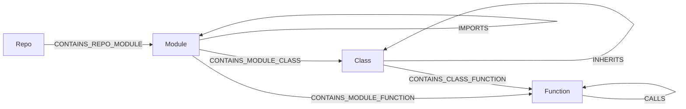

# grag

**Local-first, LLM-first graph knowledgebase.** One embedded Cypher engine ([LadybugDB](https://ladybugdb.com), the Kuzu successor), one file per database, no database server to run, nothing leaves your machine — wrapped in the tool contract LLMs actually need: schema introspection that anchors text-to-Cypher, idempotent upserts with provenance, hybrid FTS/vector search, and token-budgeted subgraph context for grounded, low-hallucination answers.

*(**G**(raph)**RAG** — retrieval-augmented generation grounded in a graph.)*

Not an enterprise platform. `pip install`, point an MCP client at it, done.

## Local-first, token-frugal

grag is built for **your** machine, not a server farm. Every developer runs their own `gragdb`, with each project's knowledge in its own `.lbdb` file. Your LLM queries *that* — locally, offline, no per-token API cost for retrieval — instead of re-reading your whole codebase every session.

The point isn't just "local storage," it's **token economics**:

- **Stop re-reading files.** An agent that greps and re-reads source every session burns thousands of tokens re-deriving structure it already knew. grag answers "what calls X / what imports Y / why did we choose Z" with a cheap Cypher or search call — tokens go to *reasoning*, not *re-discovery*.
- **Structure over bodies.** Code ingestion stores signatures, docstrings, and line ranges — never source bodies — so the graph stays tiny and queries resolve at near-zero body tokens. Fetch a body only when the graph points you at the exact `path:line_start-line_end`.
- **Token budgets everywhere.** `search_knowledge` / `get_context` return cited subgraphs packed to a budget you set, so grounding never floods the context window.
- **Context that compounds.** Decisions, conventions, and rationale the agent learns get written back (`upsert_nodes/edges` with provenance) and linked to the code they describe — so the next session starts from what you already established, not from scratch.
- **Local means private and free.** No external embedding service by default (optional local ONNX embeddings, no torch), no telemetry, no mandatory background service — the engine is embedded and the CLI and library work directly against the file. Your code and your knowledge stay on-disk, in a file you can copy, back up, or delete.

The result: an LLM that grounds its answers in *your* project's accumulated knowledge — with far fewer tokens, far less hallucination, and zero data leaving the box.

## Why a graph

LLM answers hallucinate when retrieval returns isolated chunks. grag stores knowledge as a **graph** — entities, documents, code, and their relationships — so retrieval returns a connected, cited subgraph an LLM can reason over, not a bag of fragments. And the LLM can *build* the graph itself: `define_schema` + `upsert_nodes/edges` are first-class tools, so "turn these docs (or this repo) into a knowledge graph" is a normal conversation, not a pipeline project.

## How grag differs

The space tends to split two ways: **code-graph extractors** (compile a repo into a graph artifact an assistant can traverse) and **enterprise graph platforms** (a server you operate, then bolt RAG on yourself). grag is the missing middle — an **embedded Cypher knowledgebase agents both build and retrieve from**, with hybrid search packed to a token budget. One `.lbdb` file per project, no database server to operate.

What that means in practice:

- **Writable memory, not just an extract.** Agents `define_schema` and upsert facts/decisions with `_source` provenance, so knowledge compounds across sessions instead of being re-derived every time.
- **Hybrid GraphRAG as the product surface.** BM25 + vectors → RRF → per-label diversity → k-hop expansion → cited context under a token budget (`search_knowledge` / `get_context`). Not a bag of chunks, not a bare Cypher driver.
- **Structure-only code indexing.** Signatures, docstrings, and line ranges — never source bodies. Fetch a file only when the graph points at the exact `path:line_start-line_end`.
- **MCP-shaped for self-correction.** Eight tools; `describe_schema` before Cypher so the model stops inventing labels; errors come back with hints.

Use an extractor when you want a one-shot map of a codebase. Use a graph platform when you need multi-user ops, clustering, or a shared server. Use grag when the agent should **accumulate** project knowledge locally and ground answers in a hybrid subgraph without standing up a database.

## Use it on your project (60 seconds)

```bash
pipx install 'gragdb[code,embed-local]'   # or: pip install / uv tool install
cd your-project
grag init --ingest
```

That's it. `grag init`:

- registers grag with your MCP client (Claude Code, Cursor, Windsurf, Zed — auto-detected),
- picks a **per-project port** (derived from the db path, so multiple projects never collide),
- bakes in local embeddings when the `embed-local` extra is installed,
- stores the graph at `~/.grag/<project-name>.lbdb`,
- with `--ingest`, indexes your code right away.

Restart your MCP client and ask it something ("what calls X?", "remember that we chose Y because Z"). The server auto-starts on first use; browse the graph at the URL `grag status` prints. `grag doctor` diagnoses a misbehaving setup; `grag init --remove` undoes everything.

## Install

**From PyPI** (ships the web UI):

```bash
pip install gragdb
```

Python 3.10–3.14; **3.13 recommended** (faster interpreter for the Python-side
packing/serialization paths, and 3.10 reaches end-of-life in October 2026).
Linux, macOS, and Windows are all exercised in CI. For CLI + MCP use, prefer a
`pipx` / `uv tool` install: it puts a stable `grag` on PATH, so the MCP config
`grag init` writes keeps working when project virtualenvs come and go.

**Windows note.** The current LadybugDB wheel links OpenSSL 3 without bundling
it. If opening a database fails with `Could not find lbug C API shared library`
(a misleading fallback error — the real cause is the missing OpenSSL DLLs),
install [OpenSSL 3 for Win64](https://slproweb.com/products/Win32OpenSSL.html)
and copy `libssl-3-x64.dll` and `libcrypto-3-x64.dll` from its `bin\` folder
into the `ladybug.libs` directory next to the `ladybug` package in your Python
`site-packages`. Tracked as an upstream ladybug packaging issue; this note goes
away once their wheel bundles the DLLs.

**From source** (for development). Build the UI **first** — `pip install` needs the
built bundle at `src/grag/api/static` (the wheel's force-include; see `pyproject.toml`):

```bash
cd ui && npm ci && npm run build && cd ..   # builds the UI into src/grag/api/static/
pip install -e .            # core: engine, REST, MCP, FTS — no torch, no GPU stack
pip install -e ".[dev]"     # tests
pip install -e ".[code]"          # optional: tree-sitter code parsing (ts/js/cs/tf)
pip install -e ".[embed-local]"   # optional: local embeddings (fastembed/ONNX, still no torch)
pip install -e ".[embed-remote]"  # optional: OpenAI-compatible remote embeddings
```

Without an embedder, everything works FTS-only (BM25 is native to the engine).

**LadybugDB compatibility.** This release pins LadybugDB 0.20.1 and guards its
implicit prepared-write cache in grag's engine. Do not downgrade an existing
database in place: a file opened by 0.20.x uses storage version 47 and cannot be
opened by 0.19.1 (storage version 43). A rollback requires exporting with the
newer compatible grag/Ladybug installation and importing into a fresh database.

**Enabling semantic search:** install `embed-local`, then set `GRAG_EMBED_PROVIDER=fastembed`
when serving. This uses ONNX Runtime — **no PyTorch** — so grag stays light (~50-100MB,
model downloads once then works offline). A serving process (`serve`, `mcp`) runs a
background embedding worker: ingests return immediately and the worker embeds new
nodes on its own thread, so neither ingest nor search ever embeds under the write lock
(`/api/health` reports its counters under `embedding`; `search_knowledge` reports
`pending_embeddings` while a backlog drains). `GRAG_EMBED_BACKGROUND=0` restores the
pre-0.6 inline behaviour (embed-on-search, ingest embeds its own writes). One-shot CLI
commands such as `grag ingest` still embed synchronously. Steady state is ~300ms/query
on CPU.

```bash
pip install -e ".[embed-local]"
GRAG_EMBED_PROVIDER=fastembed grag --db knowledge.lbdb serve
# optional: GRAG_EMBED_MODEL=BAAI/bge-base-en-v1.5 GRAG_EMBED_DIM=768
```

## Server management

A server is never required — the CLI and library work directly on the `.lbdb` file. But when you want the browser UI or a shared MCP endpoint, grag can run one as a background daemon (a convenience front-end over the same embedded engine, not a database service you have to operate). Daemons — whether auto-served for an MCP client or started explicitly — register themselves, so you never have to hunt processes:

```bash
grag --db ~/.grag/myproj.lbdb start    # launch in the background, frees the terminal
grag --db ~/.grag/myproj.lbdb restart  # relaunch (picks up new code after an upgrade/edit)
grag --db ~/.grag/myproj.lbdb status   # running? where? which port/log? + every server on the system
grag --db ~/.grag/myproj.lbdb stop     # stop this database's server
grag stop --all                        # stop every grag server on the system
grag doctor                            # extras, embedder, server, code-index staleness
```

`grag start` binds a stable per-database port by default (pass `--port` to override, `--no-mcp` for UI+REST only) and inherits your environment, so `GRAG_EMBED_PROVIDER=fastembed grag start` carries the embedder into the daemon.

`grag stop -a`, `grag stop -all`, and `grag stop --all` are equivalent. New
daemons use a private authenticated shutdown channel so the API and embedded
database close cleanly on every platform. After upgrading from grag 0.4.0, its
older pidfiles cannot be health/PID-verified; inspect the PIDs shown by
`grag status`, then use `grag stop --all --force` (or `grag restart --force` for
one target) once. Stop/refusal failures return a non-zero exit code.

Binding the REST/UI server beyond loopback requires `GRAG_API_TOKEN`; grag now
refuses an unauthenticated `--host 0.0.0.0`, `--host ::`, hostname, or LAN
address. `restart` preserves the recorded host, port, and MCP mode unless you
explicitly override them; a custom `--mcp-path` is preserved as well.

Daemon output lands in `~/.grag/logs/<db>-<id>.log` (not /dev/null), so an embedding failure or startup crash is always diagnosable. `grag doctor` also reports, per ingested repo, whether the code index is behind git HEAD ("index is 3 commit(s) behind — re-run ingest-code").

## Backup / portability

The `.lbdb` binary format belongs to the storage engine; the durable escape hatch is JSONL:

```bash
grag --db knowledge.lbdb export -o knowledge.jsonl   # schema + nodes + edges + provenance
grag --db fresh.lbdb import knowledge.jsonl          # replay anywhere (idempotent merge)
```

Embeddings are excluded on purpose — they're derived data and rebuild lazily after import. Commit the export to git for a team-shareable knowledgebase each developer rebuilds locally. Every database is also version-stamped on open (`created_version` / `newest_version` in `_grag_meta`), and grag warns when a database was last written by a newer grag than the one running.

## Demo quickstart

```bash
# build the demo knowledgebase (fictional company handbook, entities + relations)
python examples/build_example.py

# serve REST + the graph UI at http://127.0.0.1:8471
# (note: start it from a normal terminal — servers launched inside an agent
# sandbox get torn down and can't be reached from your browser)
grag --db examples/knowledge.lbdb serve

# single-process mode: UI + REST + MCP on one live .lbdb (recommended for
# dogfooding — the UI sees MCP writes the moment they land)
grag --db examples/knowledge.lbdb serve --with-mcp
#   UI  → http://127.0.0.1:8471/
#   MCP → http://127.0.0.1:8471/mcp   (streamable-http; point MCP clients here)

# or answer 3 demo questions end-to-end in the terminal
python examples/demo_e2e.py
```

The UI: force-graph explorer (click = inspect, double-click = expand neighbors), Cypher console (Ctrl+Enter, graph/table results), schema sidebar, and a search bar that shows the exact grounding text an LLM would receive. **Click a label in the legend** (bottom-left) to view just that label and its 1-hop relationships — e.g. click `Decision` to see only your Decisions and what they document/motivate; run a query or reload to reset the canvas. **Export SVG view** saves the currently loaded and filtered canvas view (not the whole database), including directional edges and accessible node/relationship titles. **Export full SVG** fetches every node and edge in the database (`GET /api/graph/full`, unclamped), settles them with a headless force layout in the browser, and saves the whole mass as one SVG — thousands of nodes are fine; the button shows layout progress while it runs.

**One process, one live file.** LadybugDB is single-writer, so `serve` and `mcp` can't share a `.lbdb` as separate processes. `serve --with-mcp` mounts the MCP endpoint *inside* the REST/UI server, so UI + REST + MCP share one registry and one write connection — the UI watches the AI's writes land live instead of reading a stale copy. Use `--mcp-path` to change the MCP mount path (default `/mcp`).

## Use from an LLM harness (MCP)

```bash
grag --db knowledge.lbdb mcp
```

Cursor / `.cursor/mcp.json`:

```json
{
  "mcpServers": {
    "grag": {
      "command": "grag",
      "args": ["--db", "/absolute/path/knowledge.lbdb", "mcp"]
    }
  }
}
```

Any MCP client gets these 10 tools:

| tool | purpose |
|---|---|
| `describe_schema` | prompt-shaped schema: tables, properties, row counts, sample keys. Call before writing Cypher — kills hallucinated labels. |
| `define_schema` | create node/rel tables (LLM designs the graph for a domain) |
| `upsert_nodes` / `upsert_edges` | idempotent MERGE writes; `_source` provenance automatic |
| `cypher_query` | read-only Cypher; errors come back with correction hints |
| `search_knowledge` | hybrid BM25 + vector seeds → RRF fusion → per-label diversity cap → k-hop expansion → cited, token-budgeted context |
| `get_context` | re-pack chosen node ids into a token budget |
| `ingest_code` | index a repo's code STRUCTURE (Repo/Module/Class/Function + CONTAINS/IMPORTS/CALLS/INHERITS) — never source bodies; incremental on re-run, `background=true` returns a job id |
| `ingest_docs` | index Markdown/text files on the server as `Document → Section → Chunk` graphs with `MENTIONS_*` links into the code graph (`sections=false` for flat chunks) |
| `job_status` | poll a background ingest by id |

Errors are returned as `ERROR: ... HINT: ...` tool output so the model self-corrects in-loop.

## Ingest code

Point `ingest_code` at a repo and structural questions become cheap Cypher instead of file-reading spelunking. Two entry points, same engine:

```bash
# CLI
grag --db knowledge.lbdb ingest-code src/ ../other-repo [--no-calls] [--max-file-kb 2048]
```

```
# MCP — an agent indexes a repo on demand (background=true for large trees)
ingest_code(paths=["src/"], calls=true, max_file_kb=1024)
```



Nodes carry path, line range, signature and docstring — **structure only, no source bodies** — with ids like `Module:repo-<canonical-path-sha256>:src/a.py` and `Function:repo-<canonical-path-sha256>:src/a.py#Class.method`. The path-derived repo component prevents same-named checkouts from colliding. Re-ingesting is incremental: every file is parsed (cross-file `IMPORTS`/`CALLS` need the whole set) but only files whose content changed are rewritten, and pruning of removed files, symbols and generated edges is scoped to those files. Three recipes:

```cypher
// what imports module X?
MATCH (m:Module)-[:IMPORTS]->(x:Module) WHERE x.path = 'core.py' RETURN m.id
// what calls function Y?
MATCH (f:Function)-[:CALLS]->(y:Function) WHERE y.path = 'core.py' AND y.name = 'helper' RETURN f.id
// cross-repo imports (multiple paths ingested into one db)
MATCH (r1:Repo)-[:CONTAINS_REPO_MODULE]->(a:Module)-[:IMPORTS]->(b:Module)<-[:CONTAINS_REPO_MODULE]-(r2:Repo)
WHERE r1.id <> r2.id RETURN a.id, b.id
```

Python parses via stdlib `ast` in every install. TypeScript/JavaScript/C#/Terraform (`.ts/.tsx/.js/.jsx/.mjs/.cjs/.cs/.tf`) parse via tree-sitter and need `pip install "gragdb[code]"`; without it those files raise a hint-carrying error. CALLS/INHERITS edges are Python-only for now; IMPORTS is best-effort (path/namespace-based) for the tree-sitter languages.

## Cloud / team deployment (one writer, many clients)

grag's engine is embedded and single-writer, so a shared graph is one `grag serve --with-mcp` process that owns the `.lbdb`; nobody else opens the file. Every developer's editor connects to it over HTTPS and CI keeps the code graph fresh through the jobs API. `deploy/` has a Dockerfile, compose file, systemd unit, backup and CI scripts, and a walkthrough.

```bash
# server (Docker; put a TLS proxy in front)
export GRAG_API_TOKEN="$(openssl rand -hex 32)"
docker compose -f deploy/docker-compose.yml up -d --build

# each client: writes .mcp.json with `grag mcp --server-url …` and references
# ${GRAG_API_TOKEN} from the environment (never stores it)
grag init --server-url https://grag.example.com
```

What the server does differently from a laptop:

- **Remote proxy mode.** `grag mcp --server-url URL` (env `GRAG_SERVER_URL`) bridges stdio to the remote server, never spawns a local daemon, and when the server restarts it waits, reconnects and replays the MCP handshake — the client sees at most one failed tool call. It pins the server's `database_id` on first contact and refuses to silently bridge onto a different database. Plain `http://` to a non-loopback host is refused unless `GRAG_ALLOW_INSECURE_HTTP=1`.
- **Ingest never stalls searches.** `ingest_code` is incremental: every file is parsed (cross-file `IMPORTS`/`CALLS` need the whole set) but only files whose content hash changed touch the write lock. Embeddings are produced by a background worker in the serving process (`/api/health` → `embedding`); neither ingest nor search embeds on the request thread. Long ingests go through `POST /api/jobs/ingest/code` (or `ingest_code(background=true)` + `job_status`) and return a job id.
- **Specs become a graph.** `grag ingest --sections doc.md` (MCP: `ingest_docs`) turns the heading hierarchy into `Document → Section` nodes (`SUBSECTION_OF`, `NEXT_SECTION`), chunks each section's body under it (`Chunk -IN_SECTION-> Section`, so a hit always cites its section path), and links backtick-mentioned symbols that exist in the code graph (`MENTIONS_FUNCTION` / `MENTIONS_CLASS` / `MENTIONS_MODULE`). Empty `IMPLEMENTS` (Function→Section) / `IMPLEMENTS_CLASS` tables are defined for an agent to fill with the semantic spec↔code links.
- **Online backup.** `GET /api/export` (CLI: `grag export --url URL -o backup.jsonl`) streams the JSONL export from the live server; `GRAG_WAL_AUTO_RECOVER=1` lets a supervised server recover a corrupt WAL without a TTY.

## Multiple projects

There are two distinct ways to hold several projects, depending on whether they **relate**:

**A. Related projects → one shared `.lbdb`.** Ingest several repos into the *same* database and they become separate `Repo` nodes in a single queryable graph — so the LLM can trace a call or an import across repo boundaries, or link a `Decision` in one project to a `Function` in another. This is the model for a monorepo, a system split across services, or any set of codebases that reference each other.

```bash
grag --db platform.lbdb ingest-code ../api ../web ../infra   # 3 repos, one graph
```

```cypher
// cross-repo imports, inside one db
MATCH (r1:Repo)-[:CONTAINS_REPO_MODULE]->(a:Module)-[:IMPORTS]->(b:Module)<-[:CONTAINS_REPO_MODULE]-(r2:Repo)
WHERE r1.id <> r2.id RETURN a.id, b.id
```

**B. Unrelated projects → separate `.lbdb` files.** One file = one isolated universe (no shared entities, no cross-db queries), so a throwaway experiment never pollutes a real project's graph. This is the default local-first pattern: **one `.lbdb` per project, per developer**, each queryable locally with zero per-token retrieval cost. To serve many of them at once, opt into multi-db mode with `--db-dir`:

```bash
grag --db-dir ~/kb serve    # one process serves every .lbdb in ~/kb
```

Every `/api/*` endpoint accepts `?db=<name>` or an `x-grag-db: <name>` header (query param wins). `GET /api/dbs` returns `{"dbs": ["alpha","beta"], "default": "alpha"}` (`{"dbs": [], "default": null}` in single-db mode). Without a selector the server prefers the file matching `db_path`'s name, else a lone `.lbdb`, else 400 with a hint; unknown name → 404 listing available DBs.

For MCP, several IDE windows on one DB collide: stdio spawns a `grag mcp` process per client and LadybugDB allows only ONE process to write a given `.lbdb` ("Could not set lock"). One shared HTTP server avoids it — each window sends its project name via `x-grag-db`:

```bash
grag --db-dir ~/kb mcp --transport streamable-http --host 127.0.0.1 --port 8472
```

Cursor / `.cursor/mcp.json` (per window, one header per project):

```json
{
  "mcpServers": {
    "grag": {
      "url": "http://127.0.0.1:8472/mcp",
      "headers": { "x-grag-db": "project-a" }
    }
  }
}
```

The server is localhost-only by default, and db names are routing hints, not auth — resolution rejects absolute paths and `..`. Single-db stdio (`grag --db knowledge.lbdb mcp`) remains the simple default.

**HTTP security posture.** The REST layer has no accounts or sessions; the trust model is "whoever can reach the port directly is trusted." Drive-by browser access is denied by default: a Host-header allow-list (loopbacks + the bind host) blocks DNS rebinding, and CORS grants no cross-origin access at all unless you opt in via `GRAG_CORS_ORIGINS` (the built-in UI is served same-origin and needs none). If you bind a non-loopback address, set `GRAG_API_TOKEN` — every public `/api/*` route except `/api/health` and every MCP request then requires `Authorization: Bearer <token>`. The hidden managed-daemon stop hook is not a public API: it accepts only the separate high-entropy token stored in that daemon's private `0600` registration file. Standalone HTTP MCP refuses to bind a non-loopback host without `GRAG_API_TOKEN`. On POSIX, grag also enforces `0600` on database and WAL files (and `0700` when it creates a new database directory).

## Python API

```python
from grag import GragConfig
from grag.service import GragService
from grag.core.types import SearchRequest

svc = GragService(GragConfig(db_path="knowledge.lbdb"))
res = svc.search_knowledge(SearchRequest(query="who owns the ingestion gateway?", hops=1))
print(res.context)        # cited subgraph text, ready for a prompt
```

Everything is also mirrored over REST: `POST /api/{query,search,context,ingest,ingest/code}`, `GET /api/{schema,graph/sample,health}`, `POST /api/{schema/define,nodes/upsert,edges/upsert}`.

## Retrieval: hybrid + polar-split vectors

1. Text properties get a native BM25 FTS index per searchable table.
2. With an embedder configured, embeddings are written with a **polar decomposition**: magnitude `r` in one float property, direction `u` quantized by a swappable codec. Codes only generate candidates; final scores are exact fp32 rescore + graph rerank, so recall loss is bounded and measurable.
3. Seeds (RRF-fused FTS+vector) expand k hops through the graph — structure compensates for aggressive quantization.

Codec ladder (`grag bench` reproduces these numbers on a synthetic 1500-doc corpus):

| codec | bytes/vec (dim 64) | recall@10 | note |
|---|---|---|---|
| `fp32` | 256 | 0.998 | baseline; native HNSW index |
| `int8` | 68 | 0.998 | 4x smaller, near-zero loss |
| `binary` | 8 | 0.476 | 32x, hamming scan + rescore |
| `polar` | 14 | 0.766 | experimental PolarQuant-style angular codes (sine-power-law bit allocation, training-free) |

Select with `GRAG_VECTOR_CODEC` / `GragConfig.vector_codec`. `polar` is opt-in; `int8` is the sweet spot today.

Two honest costs of the codec path: candidate generation for non-fp32 codecs is an O(rows) approximate scan (only pk + code bytes cross the wire; fp32 nodes are fetched for the 4·top_k rescore shortlist only) — that's the property `grag bench` measures, so no ANN index is involved. And the first searches after a large ingest embed lazily: at most `GRAG_MAX_EMBED_PER_SEARCH` (default 256) nodes per search call, with the remainder reported as `pending_embeddings` on the search response so agents know vector recall is still improving.

## Configuration

The CLI starts from `GragConfig.from_env()`, then an explicitly supplied CLI
option wins where that command offers one. Constructing `GragConfig(...)` in Python
uses the values you pass plus the model defaults; it does **not** read the environment
unless you call `GragConfig.from_env()`.

### Environment variables

| Variable | Accepted values | Default | What it affects |
|---|---|---|---|
| `GRAG_DB_PATH` | Filesystem path | `knowledge.lbdb` | Database used in single-database mode. In multi-db mode, its filename identifies the preferred default database. Overridden by global CLI option `--db`. |
| `GRAG_DB_DIR` | Directory path | unset | Enables multi-database mode: short database names resolve to `<dir>/<name>.lbdb`. Overridden by global CLI option `--db-dir`. |
| `GRAG_BUFFER_POOL_MB` | Integer MiB | `256` | LadybugDB buffer-pool memory. Raise it for large imports/index builds; lower it to reduce resident-memory pressure. This is not the database file size. |
| `GRAG_TOKEN_BUDGET` | Integer | `2000` | Default maximum token budget used when packing cited context for `search_knowledge`/`get_context`; request-level `token_budget` wins. |
| `GRAG_SEARCH_LABEL_CAP` | Integer | `2` | Maximum fused search seeds contributed by one node label before other labels get a turn. Prevents large tables such as `Function` from crowding out `Decision`/`Concept`. Set `0` or a negative value to disable diversity capping and use pure fused rank order. |
| `GRAG_VECTOR_CODEC` | `fp32`, `int8`, `binary`, `polar` | `fp32` | Storage/candidate-generation codec for newly embedded vectors. `fp32` uses native HNSW; compressed codecs scan compact codes for candidates and exactly rescore shortlisted fp32 vectors. Keep this consistent with existing stored codes or reindex. |
| `GRAG_POLAR_BITS_PER_DIM` | Float in `(0, 8]` | `1.0` | Approximate angular bits per vector dimension when `GRAG_VECTOR_CODEC=polar`. Higher values improve reconstruction at the cost of larger codes. Read directly by the polar codec. |
| `GRAG_MAX_EMBED_PER_SEARCH` | Non-negative integer | `256` | Maximum pending nodes embedded synchronously by one search when no background worker is running (`GRAG_EMBED_BACKGROUND=0`, or library use without a serving process). Remaining work is reported as `pending_embeddings`. |
| `GRAG_EMBED_BACKGROUND` | `1`/`0` | `1` | Serving processes run a background embedding worker per database, so ingests and searches never embed on the request thread. `0` restores inline embedding (search embeds up to `GRAG_MAX_EMBED_PER_SEARCH`; ingest embeds its own writes). |
| `GRAG_SERVER_URL` | `https://host[:port]` | unset | Remote-server mode: `grag mcp` proxies stdio to this already-running grag server instead of auto-serving a local daemon, and `grag export` streams `GET /api/export` from it. The proxy never opens a `.lbdb`; it reconnects and replays the MCP handshake when the server restarts. |
| `GRAG_SERVER_DB` | Database name | unset | With `GRAG_SERVER_URL`: the `x-grag-db` header for a multi-db (`--db-dir`) server. |
| `GRAG_ALLOW_INSECURE_HTTP` | `1`/`0` | `0` | Permit a plain-`http://` `GRAG_SERVER_URL` to a non-loopback host (the bearer token then travels unencrypted). |
| `GRAG_WAL_AUTO_RECOVER` | `1`/`0` | `0` | Supervised servers (systemd, containers) have no TTY to approve WAL recovery; with `1` a corrupt WAL is recovered on open (writes since the last checkpoint are lost, vector indexes rebuilt) instead of crash-looping. |
| `GRAG_EMBED_PROVIDER` | `fastembed` or `remote` | unset | Enables vector search. Unset means BM25/FTS-only retrieval. `fastembed` is local; `remote` sends embedding input to the configured OpenAI-compatible service. |
| `GRAG_EMBED_MODEL` | Provider model name | `BAAI/bge-small-en-v1.5` | Embedding model identifier, used only when `GRAG_EMBED_PROVIDER` is set. Changing it invalidates/rebuilds affected embeddings lazily. |
| `GRAG_EMBED_DIM` | Positive integer | `384` | Embedding vector width. It must match the selected model's actual output dimension and the stored vector column. |
| `GRAG_EMBED_BASE_URL` | URL | unset | OpenAI-compatible endpoint root for the `remote` provider; required when using a remote embedding service. |
| `GRAG_EMBED_API_KEY_ENV` | Name of another environment variable | unset | Tells the remote provider which environment variable contains its bearer API key. This value is a variable **name**, not the secret itself. No authorization header is sent when unset. |
| `GRAG_API_TOKEN` | Non-empty bearer token | unset | Requires `Authorization: Bearer <token>` on REST routes except `/api/health`, and on HTTP MCP. A non-loopback standalone HTTP MCP bind is rejected when this is unset. The built-in UI stores a supplied token in that browser only. |
| `GRAG_CORS_ORIGINS` | Comma-separated origins | unset (no cross-origin access) | Adds allowed browser origins for separately hosted clients, for example `https://app.example.com,http://localhost:5173`. The built-in same-origin UI needs no entry; credentials remain disabled. |

Embedding-specific variables are ignored until `GRAG_EMBED_PROVIDER` is set. For
local semantic search, install the optional dependency first:

```bash
pip install 'gragdb[embed-local]'
GRAG_EMBED_PROVIDER=fastembed grag --db knowledge.lbdb serve
```

### Python-only `GragConfig` options

These controls currently have no `GRAG_*` environment equivalent. Pass them when
embedding grag as a Python library; the CLI exposes the server-related subset shown
in the next table.

| `GragConfig` field | Type | Default | What it affects |
|---|---|---|---|
| `max_read_conns` | `int` | `4` | Maximum pooled read connections. Writes still serialize through one write connection. |
| `default_query_limit` | `int` | `100` | Row limit applied when a query/request does not provide one. |
| `max_query_limit` | `int` | `1000` | Server-side ceiling for requested query/search limits. |
| `max_hops` | `int` | `3` | Maximum graph-expansion depth accepted by retrieval/context requests. |
| `statement_timeout_ms` | `int` | `30000` | Maximum LadybugDB statement execution time in milliseconds. |
| `mcp_path` | `str \| None` | `None` | Mounts streamable HTTP MCP into the REST/UI app at this path. `None` leaves MCP unmounted. CLI equivalent: `serve --with-mcp --mcp-path /mcp`. |
| `host` | `str` | `127.0.0.1` | Expected bind host used by Host-header/DNS-rebinding allow-lists. The CLI's `serve --host` or `mcp --host` sets the runtime bind. |

The remaining `GragConfig` fields map directly to the environment table:
`db_path`, `db_dir`, `buffer_pool_size` (bytes rather than MiB),
`default_token_budget`, `search_label_cap`, `vector_codec`, `embedder`,
`api_token`, `cors_origins`, `max_embed_per_search`, `embed_in_background`, `server_url`,
`server_db`, `allow_insecure_http`, and `wal_auto_recover`. `EmbedderConfig` contains
`provider`, `model`, `dim`, `base_url`, and `api_key_env`, with the same meanings and
defaults listed above.

### CLI options

Use `grag --help` and `grag <command> --help` for the authoritative command syntax.
The configuration-affecting options are:

| Command/option | Default | What it affects |
|---|---|---|
| global `--db PATH` | `GRAG_DB_PATH` or `knowledge.lbdb` | Selects one database file for any command. Mutually exclusive with `--db-dir`. |
| global `--db-dir DIR` | `GRAG_DB_DIR` or unset | Selects a directory of databases for multi-db serving. Mutually exclusive with `--db`. |
| `serve --host HOST` | `127.0.0.1` | REST/UI bind address and Host-header allow-list. Set `GRAG_API_TOKEN` before using a non-loopback address. |
| `serve --port PORT` | `8471` | REST/UI listening port. |
| `serve --with-mcp` | off | Mounts MCP in the REST/UI process so all surfaces safely share the embedded database's one writer. |
| `serve --mcp-path PATH` | `/mcp` | Mount path used with `--with-mcp`. |
| `mcp --transport MODE` | `stdio` | Chooses `stdio` or `streamable-http`. |
| `mcp --host HOST` | `127.0.0.1` | Standalone HTTP MCP bind address. A non-loopback address requires `GRAG_API_TOKEN`. |
| `mcp --port PORT` | `8471` | Standalone HTTP MCP port, or the shared server target for `--auto-serve`. |
| `mcp --path PATH` | `/mcp` | Standalone streamable HTTP endpoint path. |
| `mcp --auto-serve` | off | Keeps the client transport on stdio but proxies it to a shared `serve --with-mcp` process, starting that process when needed. |
| `mcp --server-url URL` | `GRAG_SERVER_URL` or unset | Proxies stdio to a remote, already-running grag server (cloud host). Never spawns a daemon; waits and reconnects across server restarts; pins the server's `database_id`. Takes precedence over `--auto-serve`. |
| `mcp --server-db NAME` | `GRAG_SERVER_DB` or unset | Database name sent as `x-grag-db` to a multi-db remote server. |
| `mcp --insecure-http` | off | Allow a plain-http `--server-url` to a non-loopback host. |
| `ingest --sections` | off | Section-aware Markdown ingest: `Document → Section` nodes from the heading hierarchy, chunks linked `IN_SECTION`, backtick-mentioned code symbols linked to the code graph. Paths may be directories. |
| `start --host HOST` | `127.0.0.1` | Starts a managed background REST/UI server on this host. Non-loopback binds require `GRAG_API_TOKEN`. |
| `start --port PORT` | per-database derived port | Port for the managed background server. |
| `start --no-mcp` | off | Starts the managed server without its normally enabled MCP endpoint. |
| `start --mcp-path PATH` | `/mcp` | Mounted MCP path for the managed background server. |
| `restart --host HOST` | preserve current | Overrides the registered bind host while restarting. |
| `restart --port PORT` | preserve current | Overrides the registered port while restarting. |
| `restart --with-mcp` / `--no-mcp` | preserve current | Enables or disables mounted MCP while restarting. |
| `restart --mcp-path PATH` | preserve current | Overrides the mounted MCP path while restarting. |
| `restart --force` | off | Allows one-time migration of a live legacy registration after independently verifying its PID. |
| `ingest-code --no-calls` | off | Skips Python `CALLS` edge extraction. |
| `ingest-code --max-file-kb N` | `1024` | Skips source files larger than this many KiB. |
| `bench --codec CODEC` | all codecs | Benchmarks only the named codec; without it, the benchmark runs `fp32`, `int8`, `binary`, and `polar`. |
| `reindex --batch-size N` | `128` | Number of nodes embedded per reindex batch. |
| `status` | — | Shows whether a server is running for the selected database, on which port, and where its log is. |
| `stop` | — | Gracefully stops the managed background server for the selected database. |
| `stop -a` / `-all` / `--all` | off | Stops every safely verifiable managed grag server. Refuses unresolved legacy registrations instead of reporting false success. |
| `stop --force` | off | Also permits signaling a live legacy/unverified registration; use only after independently verifying its recorded PID. |
| `doctor` | — | Install/runtime health report: extras, embedder, env, server, code-index staleness vs git HEAD. |
| `export --out FILE` | stdout | Dumps the database as portable JSONL (schema, nodes, edges, provenance; embeddings excluded). |
| `export --url URL` | `GRAG_SERVER_URL` or unset | Online backup: streams `GET /api/export` from a running server (bearer from `GRAG_API_TOKEN`) instead of opening the file, which the single-writer lock forbids while a server runs. `--server-db` selects the database on a multi-db server. |
| `import FILE` | — | Replays a `grag export` file into the selected database (idempotent merge). |
| `init --client CLIENT` | `auto` | MCP client to configure: `claude`, `cursor`, `windsurf`, `zed`, or auto-detection. |
| `init --port PORT` | derived per-project | Port written into generated MCP/shared-server configuration. The default is derived from the database path (41000–49151), so initialised projects don't collide on one port. |
| `init --ingest` | off | Also runs `ingest-code` on the current directory immediately. |
| `init --remove` | off | Undoes init: removes the grag MCP entry and the CLAUDE.md block. |
| `init --url` | off | Writes direct HTTP URL transport instead of stdio plus auto-serve; the shared server must already be running. |
| `init --server-url URL` | unset | Registers a remote grag server instead of a local database: MCP config runs `grag mcp --server-url` (or, with `--url`, points at the server's `/mcp/` with a bearer header), referencing `${GRAG_API_TOKEN}` rather than storing it; CLAUDE.md documents the shared graph. `--server-db` selects a multi-db database. |
| `init --no-mcp` | off | Skips MCP client configuration. |
| `init --no-claude-md` | off | Skips the `CLAUDE.md` guidance block. |
| `init --dry-run` | off | Shows planned configuration writes without changing files. |

`grag init` has one intentional database-path exception: without an explicit global
`--db`, it writes `~/.grag/<current-project-name>.lbdb` into the generated client
configuration rather than using `knowledge.lbdb`. When the `embed-local` extra is
installed, init also bakes `GRAG_EMBED_PROVIDER=fastembed` into the MCP entry so the
auto-served daemon gets semantic search without any manual env setup. The CLI prevents
`--db` and `--db-dir` from appearing together. An explicit CLI selector also clears
the opposite selector inherited from the environment, so `--db` overrides
`GRAG_DB_DIR` and `--db-dir` overrides `GRAG_DB_PATH`.

## Performance budget

Measured — `tests/test_perf.py` guards cold start (< 2s), search latency, and RSS; `grag bench` reports recall + p50/p95 + RSS per codec. Design rules: no heavy deps in the default install, one process for API+UI, lazy embedder loading, default `LIMIT`s, hop caps, statement timeouts, token budgets everywhere.

## Storage conventions

- One `.lbdb` file per database. Properties starting with `_` are grag-internal.
- Provenance: `_source`, `_created_at` on every table created via `define_schema`.
- Vector columns (`embedding`, `_emb_r`, `_emb_code`, `_emb_model`) are added lazily by the retrieval layer.
- `_grag_tables` registry powers introspection and canonical `Label:key` node ids.

## Develop

```bash
python -m pytest tests/          # 400+ tests
ruff check src tests && mypy src/grag   # CI gates on both
grag bench                        # codec recall/latency/RSS table
cd ui && npm run build            # rebuilds the UI into src/grag/api/static/
```

See **[CONTRIBUTING.md](CONTRIBUTING.md)** for the branching model (Gitflow-lite:
`main` + `dev` + `feature`/`release`/`hotfix`), PR rules, and how releases are
cut and published to PyPI.

Known limits: embedded engine = single-writer; LadybugDB reserves a large *virtual* address space per open database (actual RSS stays within the buffer pool) — close `Engine`s you create; polar codec encode is Python-speed (fine at query time, slower at write time).
