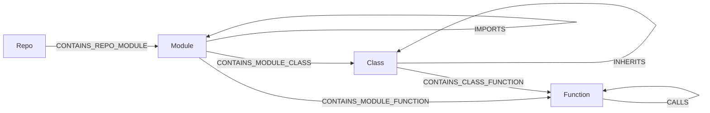

# grag

**Local-first, LLM-first graph knowledgebase.** One embedded Cypher engine ([LadybugDB](https://ladybugdb.com), the Kuzu successor), one file per database, no database server to run, nothing leaves your machine — wrapped in the tool contract LLMs actually need: schema introspection that anchors text-to-Cypher, idempotent upserts with provenance, hybrid FTS/vector search, and token-budgeted subgraph context for grounded, low-hallucination answers.

*(**G**(raph)**RAG** — retrieval-augmented generation grounded in a graph.)*

Not an enterprise platform. `pip install`, point an MCP client at it, done.

## Local-first, token-frugal

grag is built for **your** machine, not a server farm. Every developer runs their own `gragdb`, with each project's knowledge in its own `.lbdb` file. Your LLM queries *that* — locally, offline, no per-token API cost for retrieval — instead of re-reading your whole codebase every session.

The point isn't just "local storage," it's **token economics**:

- **Stop re-reading files.** An agent that greps and re-reads source every session burns thousands of tokens re-deriving structure it already knew. grag answers "what calls X / what imports Y / why did we choose Z" with a cheap Cypher or search call — tokens go to *reasoning*, not *re-discovery*.
- **Structure over bodies.** Code ingestion stores signatures, docstrings, and line ranges — never source bodies — so the graph stays tiny and queries resolve at near-zero body tokens. Fetch a body only when the graph points you at the exact `path:line_start-line_end`.
- **Token budgets everywhere.** `search_knowledge` / `get_context` return cited subgraphs packed to a budget you set, so grounding never floods the context window.
- **Context that compounds.** Decisions, conventions, and rationale the agent learns get written back (`upsert_nodes/edges` with provenance) and linked to the code they describe — so the next session starts from what you already established, not from scratch.
- **Local means private and free.** No external embedding service by default (optional local ONNX embeddings, no torch), no telemetry, no mandatory background service — the engine is embedded and the CLI and library work directly against the file. Your code and your knowledge stay on-disk, in a file you can copy, back up, or delete.

The result: an LLM that grounds its answers in *your* project's accumulated knowledge — with far fewer tokens, far less hallucination, and zero data leaving the box.

## Why a graph

LLM answers hallucinate when retrieval returns isolated chunks. grag stores knowledge as a **graph** — entities, documents, code, and their relationships — so retrieval returns a connected, cited subgraph an LLM can reason over, not a bag of fragments. And the LLM can *build* the graph itself: `define_schema` + `upsert_nodes/edges` are first-class tools, so "turn these docs (or this repo) into a knowledge graph" is a normal conversation, not a pipeline project.

## How grag differs

The space tends to split two ways: **code-graph extractors** (compile a repo into a graph artifact an assistant can traverse) and **enterprise graph platforms** (a server you operate, then bolt RAG on yourself). grag is the missing middle — an **embedded Cypher knowledgebase agents both build and retrieve from**, with hybrid search packed to a token budget. One `.lbdb` file per project, no database server to operate.

What that means in practice:

- **Writable memory, not just an extract.** Agents `define_schema` and upsert facts/decisions with `_source` provenance, so knowledge compounds across sessions instead of being re-derived every time.
- **Hybrid GraphRAG as the product surface.** BM25 + vectors → RRF → per-label diversity → k-hop expansion → cited context under a token budget (`search_knowledge` / `get_context`). Not a bag of chunks, not a bare Cypher driver.
- **Structure-only code indexing.** Signatures, docstrings, and line ranges — never source bodies. Fetch a file only when the graph points at the exact `path:line_start-line_end`.
- **MCP-shaped for self-correction.** Ten tools; `describe_schema` before Cypher so the model stops inventing labels; errors come back with hints.

Use an extractor when you want a one-shot map of a codebase. Use a graph platform when you need multi-user ops, clustering, or a shared server. Use grag when the agent should **accumulate** project knowledge locally and ground answers in a hybrid subgraph without standing up a database.

## Use it on your project (60 seconds)

```bash
pipx install 'gragdb[code,embed-local]'   # or: pip install / uv tool install
cd your-project
grag init --ingest
```

That's it. `grag init`:

- registers grag with your MCP client (Claude Code, Cursor, Windsurf, Zed — auto-detected),
- picks a **per-project port** (derived from the database path),
- bakes in local embeddings when the `embed-local` extra is installed,
- saves the checkout's database choice in `.grag/project.json`, with a new graph at `~/.grag/<project-name>-<checkout-id>.lbdb` by default,
- with `--ingest`, indexes your code right away.

Restart your MCP client and ask it something ("what calls X?", "remember that we chose Y because Z"). The server auto-starts on first use; browse the graph at the URL `grag status` prints. `grag doctor` diagnoses a misbehaving setup; `grag init --remove` removes grag's registration, instruction block, and unmodified generated skills. Modified skills are reported for manual removal; the database and checkout mapping stay in place.

Run commands from the checkout root or a subdirectory: they select the same
database. `init` finds the enclosing Git root or existing grag project root.
Each new checkout/worktree gets its own identity and database, even when folder
names match. The local mapping is Git-ignored; do not commit or copy it between
worktrees. To intentionally share memory, run `grag --db /path/to/shared.lbdb init`
in each checkout and use one server for that database.

Existing absolute database paths in project Claude/Cursor registrations are
respected; rerun `init` to save the mapping. An existing root `knowledge.lbdb` can
also be adopted. A `~/.grag/<folder-name>.lbdb` file alone cannot establish which
checkout owns it: choose it explicitly with `--db <file> init`. Conflicting or
ambiguous registrations fail with an explanation rather than selecting a new graph.

After moving a folder, stop its server and disconnect clients that auto-start it:

```bash
grag relocate /previous/project /current/project --dry-run
grag relocate /previous/project /current/project
```

The command uses the destination's mapping; `--db <existing-file>` overrides it
for older installations. It updates indexed roots, `_source` citations, saved
indexing scope, and local Claude/Cursor launch paths while retaining node IDs,
memory text, and relationships. A moved grag virtualenv launcher is replaced with
the currently functioning grag command. The database stays where it is; if it was
inside the moved folder, the mapping selects its existing new path. With no
database present, a matching mapping can still be updated; this is reported and
no database is created. Copies use `init` for a fresh identity; relocation requires
the old directory to be absent.

Graph changes commit together. Client-file writes use the init backups described
below. If file publication fails after the graph commits, rerun the same command
to finish configuration. Dry runs open existing databases read-only. Restart clients
afterward; code freshness must verify the new location. Legacy indexes with no
saved options still need one explicit ingest with the intended scope. Re-run
`init --client <client>` for user-scope registrations; discovery/repair of linked
skills and arbitrary client installations remains separate work. Existing document
nodes survive relocation, but later document re-ingestion can produce new IDs
after a move; document synchronization does not yet preserve their identity
across relocation.

Use `grag init --dry-run` (or `grag init --remove --dry-run`) to review the actual
diffs before applying. Diffs include changed configuration values. Init validates
JSON and the registration's object structure; invalid or unreadable files stop
the operation with their paths intact. Zed's JSONC comments and unrelated settings
are preserved. Duplicate JSON keys and ambiguous `CLAUDE.md` markers are refused.

Every apply stages its writes and preserves original bytes in
`~/.grag/backups/init/run-*/` before replacing or deleting a file. The command prints
that directory; `manifest.json` maps each numbered `.original` backup to its full
path, original permission mode, and before/after SHA-256 hashes. To restore a file,
close its client/editor, compare the current file with the manifest, copy that
file's `.original` back to the recorded path, and restore its recorded mode.
Entries with no backup describe newly created files. Backups are retained until
you remove them; on POSIX, backup directories/files are private to your user.

Each file replacement is atomic. A crash between files can leave a partially
applied setup: the manifest's hashes identify which files changed, and a separate
valid `complete.json` marks a finished run. Init rejects stale plans and overlapping
grag init writers; close external config editors during apply because they do not
share that lock. Symlinked/hardlinked config files are left intact for manual
configuration. Existing POSIX permission modes are preserved; custom ACLs and
extended file attributes are not copied to replacement files.

## Install

**From PyPI** (ships the web UI):

```bash
pip install gragdb
```

Python 3.10–3.14; **3.13 recommended** (faster interpreter for the Python-side
packing/serialization paths, and 3.10 reaches end-of-life in October 2026).
Linux, macOS, and Windows are all exercised in CI. For CLI + MCP use, prefer a
`pipx` / `uv tool` install: it puts a stable `grag` on PATH, so the MCP config
`grag init` writes keeps working when project virtualenvs come and go.

**Windows note.** The current LadybugDB wheel links OpenSSL 3 without bundling
it. If opening a database fails with `Could not find lbug C API shared library`
(a misleading fallback error — the real cause is the missing OpenSSL DLLs),
install [OpenSSL 3 for Win64](https://slproweb.com/products/Win32OpenSSL.html)
and copy `libssl-3-x64.dll` and `libcrypto-3-x64.dll` from its `bin\` folder
into the `ladybug.libs` directory next to the `ladybug` package in your Python
`site-packages`. Tracked as an upstream ladybug packaging issue; this note goes
away once their wheel bundles the DLLs.

**From source** (for development). Build the UI **first** — `pip install` needs the
built bundle at `src/grag/api/static` (the wheel's force-include; see `pyproject.toml`):

```bash
cd ui && npm ci && npm run build && cd ..   # builds the UI into src/grag/api/static/
pip install -e .            # core: engine, REST, MCP, FTS — no torch, no GPU stack
pip install -e ".[dev]"     # tests
pip install -e ".[code]"          # optional: tree-sitter code parsing (ts/js/cs/tf)
pip install -e ".[embed-local]"   # optional: local embeddings (fastembed/ONNX, still no torch)
pip install -e ".[embed-remote]"  # optional: OpenAI-compatible remote embeddings
```

To have the normal CLI and MCP launcher use this checkout, install it in editable
mode with pipx after building the UI:

```bash
pipx install --force --editable '.[code,embed-local]'
command -v grag
```

This replaces pipx's `gragdb` installation with a link to the checkout. New
processes load your Python edits directly; stop the server for the selected
database (`grag --db <file> stop`) and reconnect MCP after editing running code.
UI changes still need `npm run build` in `ui`. Keep the checkout at this path.
Check that `command -v grag` and the MCP registration select the intended launcher;
another installation earlier on `PATH` can still run different code. The database
selection is independent of the installation.

From a Python environment with the development dependencies, exercise the
installed command's MCP memory loop without a `PYTHONPATH` override:

```bash
GRAG_TEST_COMMAND="$(command -v grag)" python -m pytest -o addopts= -q tests/test_agent_workflow.py
```

The test launches that command outside the checkout, uses temporary source and
database files, and verifies ingestion, recall, corrections, fresh citations,
retry handling, and memory after restarting MCP. It uses full-text search; local
embeddings and language grammars may need an initial download before offline use.

Without an embedder, everything works FTS-only (BM25 is native to the engine).

**LadybugDB compatibility.** This release pins LadybugDB 0.20.2. grag disables the
engine's cached-physical-plan fast path on every connection (`CALL
enable_cached_prepared_statement='none'`, the upstream kill switch for the
LadybugDB/ladybug#877 family of stale-re-execution bugs) and falls back to per-statement
eviction of the private prepared-statement cache on older runtimes. Do not downgrade an existing
database in place: a file opened by 0.20.x uses storage version 47 and cannot be
opened by 0.19.1 (storage version 43). A rollback requires exporting with the
newer compatible grag/Ladybug installation and importing into a fresh database.

**Enabling semantic search:** install `embed-local`, then set `GRAG_EMBED_PROVIDER=fastembed`
when serving. This uses ONNX Runtime — **no PyTorch** — so grag stays light (~50-100MB,
model downloads once then works offline). A serving process (`serve`, `mcp`) runs a
background embedding worker: ingests return immediately and the worker embeds new
nodes on its own thread, so neither ingest nor search ever embeds under the write lock
(`/api/health` reports its counters under `embedding`; `search_knowledge` reports
`pending_embeddings` while a backlog drains). `GRAG_EMBED_BACKGROUND=0` restores the
pre-0.6 inline behaviour (embed-on-search, ingest embeds its own writes). One-shot CLI
commands such as `grag ingest` still embed synchronously. Steady state is ~300ms/query
on CPU.

**Code reads report whether their index is verified.** Serving processes check the
contents of supported files in each registered scope, plus Git HEAD when present.
Plain folders work too; changes do not depend on modification timestamps. Checks
and refreshes share the background job queue, and concurrent readers share one
verification job. Normal reads trigger a check at most every
`GRAG_AUTO_REFRESH_INTERVAL_S` seconds (default 30); failed work remains visible
and retries on subsequent reads with exponential backoff, from 1 to 300 seconds.
Waiting reads drive retries within their deadline. An idle server does not poll.

MCP `describe_schema`, `cypher_query`, `search_knowledge`, and `get_context` accept
`freshness` and `freshness_timeout_ms`. The corresponding Python service methods
and REST endpoints use the same policy; REST graph, schema, index-status, and
export GETs take it as query parameters. The UI provides these choices as well:

| `freshness` | Read behavior |
|---|---|
| `allow_stale` (default) | Schedule a due check and read the current graph without waiting for verification. |
| `wait` | Request a new check or join the active one; wait up to the deadline, then allow an unverified read with `timed_out: true`. |
| `require` | Wait as above, but reject the read if freshness cannot be verified. REST returns HTTP 503 with `code: "freshness_unavailable"`; MCP returns an error and freshness footer; Python raises `FreshnessError`. |

`freshness_timeout_ms` defaults to 5000 and accepts 0–60000. The deadline bounds
the verification wait, not execution of the graph query. Waiting modes bypass
the normal check interval, respect failure backoff, and leave shared work running
after a timeout. For example, call `search_knowledge(query="where is X defined",
freshness="require", freshness_timeout_ms=10000)` when an answer depends on edits.

Read responses include `freshness: {status, checked_at, timed_out}` in JSON or the
MCP/text footer; JSONL export carries it in the `X-Grag-Freshness` header. Status is
`fresh`, `checking`, `refreshing`, `stale`, `error`, `unknown`, or `disabled`.
Only `fresh` means the registered code scope was verified at that check. It does
not certify agent-authored memories, embeddings, or edits made after verification,
and it does not provide a transactionally consistent export snapshot. Inspect
`GET /api/index/status` for each root's observed, pending, and last successful
generation, saved options, error, and retry delay. It uses the selected database
and normal authentication; anonymous `/api/health` exposes only the default
database's summary counters and freshness under `code_index`.

An explicit `ingest_code` saves its paths, `calls`, `max_file_kb`, and `incremental`
options for later refreshes and restarts. File-only scopes stay file-only; partial
ingests retain previously registered paths under the same root, and the latest
explicit options apply to that saved scope. A partial or failed ingest cannot
advance the last verified generation. Indexes created before this metadata existed
report `unknown`: explicitly run `ingest_code` once with the intended scope and
options to enroll them. Missing or relocated paths, parse/access failures, and
previously indexed files that now exceed the size limit stay unverified with
diagnostics; they never silently become fresh. Scope removal and relocation need
explicit reconciliation. `GRAG_AUTO_REFRESH_CODE=0` disables checking; direct Python
services opt in with `service.enable_auto_refresh()`. A required-fresh read fails
when checking is disabled.

**Labels converge instead of fragmenting.** `define_schema` refuses a new table whose name only differs from an existing one by case, plural or punctuation (`Decisions` vs `Decision`, `todo_item` vs `TodoItem`) and names the existing table in the hint; `allow_similar=true` creates it anyway. The packaged skill adds a suggested session-memory vocabulary (`Task`, `Decision`, `Insight`, `Question`) and the reuse-before-invent rule, without shipping a fixed schema.

**What gets embedded, and how.** A node's embedding text is its STRING properties minus
side-cars that only dilute the vector (`meta`, `path`, `heading_path`, `language`, git
fields — `GRAG_EMBED_EXCLUDE_PROPS` overrides the list; `EmbedderConfig.text_props`
pins an explicit list per label). Queries and documents get the retrieval prefixes the
model family expects (bge/arctic/mxbai: query instruction; nomic: `search_query:` /
`search_document:`; e5: `query:` / `passage:`), overridable with
`GRAG_EMBED_QUERY_PREFIX` / `GRAG_EMBED_DOC_PREFIX`. Changing the model, the prefixes
or the effective text policy makes old vectors pending; they rebuild automatically
on the worker or subsequent searches. Codec and remote endpoint changes also trigger
rebuilding. Legacy vectors without a configuration fingerprint rebuild once.
Use `grag reindex` to rebuild immediately, or when a model changes behind the same
model name and endpoint. Changing vector dimensions still requires an explicit
storage migration; grag reports the mismatch without dropping data.
Concurrent text edits discard in-flight embeddings and leave the new text pending.
To pick a model on
your own data rather than a leaderboard, `examples/embedding_eval.py` scores candidates
(vector-only, BM25-only, hybrid recall@k and MRR, embed time, query latency) against a
`grag export` and a question set — `--auto N` derives proxy questions from a
`--sections` ingest.

```bash
pip install -e ".[embed-local]"
GRAG_EMBED_PROVIDER=fastembed grag --db knowledge.lbdb serve
# optional: GRAG_EMBED_MODEL=BAAI/bge-base-en-v1.5 GRAG_EMBED_DIM=768
```

## Server management

A server is never required — the CLI and library work directly on the `.lbdb` file. But when you want the browser UI or a shared MCP endpoint, grag can run one as a background daemon (a convenience front-end over the same embedded engine, not a database service you have to operate). Daemons — whether auto-served for an MCP client or started explicitly — register themselves, so you never have to hunt processes:

```bash
grag --db ~/.grag/myproj.lbdb start    # launch in the background, frees the terminal
grag --db ~/.grag/myproj.lbdb restart  # relaunch (picks up new code after an upgrade/edit)
grag --db ~/.grag/myproj.lbdb status   # running? where? which port/log? + every server on the system
grag --db ~/.grag/myproj.lbdb stop     # stop this database's server
grag stop --all                        # stop every grag server on the system
grag doctor                            # extras, embedder, server, code-index staleness
```

`grag start` binds a stable per-database port by default (pass `--port` to override, `--no-mcp` for UI+REST only) and inherits your environment, so `GRAG_EMBED_PROVIDER=fastembed grag start` carries the embedder into the daemon.

`grag stop -a`, `grag stop -all`, and `grag stop --all` are equivalent. New
daemons use a private authenticated shutdown channel so the API and embedded
database close cleanly on every platform. After upgrading from grag 0.4.0, its
older pidfiles cannot be health/PID-verified; inspect the PIDs shown by
`grag status`, then use `grag stop --all --force` (or `grag restart --force` for
one target) once. Stop/refusal failures return a non-zero exit code.

Shutdown stops accepting work, marks queued jobs `cancelled`, and drains active
ingestion, code verification, requests, and embedding before closing the database.
The grace period is 10 seconds across the server's databases. If work outlasts it,
grag reports the pending jobs/worker and keeps the database open until that work
finishes; it does not close native connections underneath a live worker. A stuck
Python/native call can keep the process alive. Check the daemon log and retained
server registration when stop reports that the process has not exited. Cancelled
jobs need resubmission after restart; job records remain process-local.

Python callers can use `service.close(timeout=...)` and `service.shutdown_status()`
to inspect `state`, `engine_closed`, active operations, job outcomes, and the
embedding worker. Repeated close calls wait on the same drain. A closed service
or registry cannot be reused; create a new instance after shutdown completes.

Binding the REST/UI server beyond loopback requires `GRAG_API_TOKEN`; grag now
refuses an unauthenticated `--host 0.0.0.0`, `--host ::`, hostname, or LAN
address. `restart` preserves the recorded host, port, and MCP mode unless you
explicitly override them; a custom `--mcp-path` is preserved as well.

Daemon output lands in `~/.grag/logs/<db>-<id>.log` (not /dev/null), so an embedding failure or startup crash is always diagnosable. `grag doctor` also reports, per ingested repo, whether the code index is behind git HEAD ("index is 3 commit(s) behind — re-run ingest-code").

## Backup / portability

The `.lbdb` binary format belongs to the storage engine; the durable escape hatch is JSONL:

```bash
grag --db knowledge.lbdb export -o knowledge.jsonl   # schema + nodes + edges + provenance
grag --db fresh.lbdb import knowledge.jsonl          # replay anywhere (idempotent merge)
```

Embeddings are excluded on purpose — they're derived data and rebuild lazily after import. Commit the export to git for a team-shareable knowledgebase each developer rebuilds locally. Every database is also version-stamped on open (`created_version` / `newest_version` in `_grag_meta`), and grag warns when a database was last written by a newer grag than the one running.

## Demo quickstart

```bash
# build the demo knowledgebase (fictional company handbook, entities + relations)
python examples/build_example.py

# serve REST + the graph UI at http://127.0.0.1:8471
# (note: start it from a normal terminal — servers launched inside an agent
# sandbox get torn down and can't be reached from your browser)
grag --db examples/knowledge.lbdb serve

# single-process mode: UI + REST + MCP on one live .lbdb (recommended for
# dogfooding — the UI sees MCP writes the moment they land)
grag --db examples/knowledge.lbdb serve --with-mcp
#   UI  → http://127.0.0.1:8471/
#   MCP → http://127.0.0.1:8471/mcp   (streamable-http; point MCP clients here)

# or answer 3 demo questions end-to-end in the terminal
python examples/demo_e2e.py
```

The UI: force-graph explorer (click = inspect, double-click = expand neighbors), Cypher console (Ctrl+Enter, graph/table results), schema sidebar, and a search bar that shows the exact grounding text an LLM would receive. **Click a label in the legend** (bottom-left) to view just that label and its 1-hop relationships — e.g. click `Decision` to see only your Decisions and what they document/motivate; run a query or reload to reset the canvas. **Export SVG view** saves the currently loaded and filtered canvas view (not the whole database), including directional edges and accessible node/relationship titles. **Export full SVG** fetches every node and edge in the database (`GET /api/graph/full`, unclamped), settles them with a headless force layout in the browser, and saves the whole mass as one SVG — thousands of nodes are fine; the button shows layout progress while it runs.

**One process, one live file.** LadybugDB is single-writer, so `serve` and `mcp` can't share a `.lbdb` as separate processes. `serve --with-mcp` mounts the MCP endpoint *inside* the REST/UI server, so UI + REST + MCP share one registry and one write connection — the UI watches the AI's writes land live instead of reading a stale copy. Use `--mcp-path` to change the MCP mount path (default `/mcp`).

## Use from an LLM harness (MCP)

```bash
grag --db knowledge.lbdb mcp
```

Cursor / `.cursor/mcp.json`:

```json
{
  "mcpServers": {
    "grag": {
      "command": "grag",
      "args": ["--db", "/absolute/path/knowledge.lbdb", "mcp"]
    }
  }
}
```

Any MCP client gets these 10 tools:

| tool | purpose |
|---|---|
| `describe_schema` | compact schema: tables, property types, primary keys and directed endpoints. Optional full detail and revision-based reuse. Call before writing Cypher. |
| `define_schema` | create node/rel tables (LLM designs the graph for a domain) |
| `upsert_nodes` / `upsert_edges` | atomic MERGE batches; optional retry IDs and revision checks; `_source` provenance automatic |
| `cypher_query` | read-only Cypher; errors come back with correction hints |
| `search_knowledge` | hybrid BM25 + vector seeds → RRF fusion → per-label diversity cap → k-hop expansion → cited, token-budgeted context |
| `get_context` | re-pack chosen node ids; page long STRING values with `text_property` |
| `ingest_code` | index a repo's code STRUCTURE (Repo/Module/Class/Function + CONTAINS/IMPORTS/CALLS/INHERITS) — never source bodies; incremental on re-run, `background=true` returns a job id |
| `ingest_docs` | index Markdown/text files on the server as `Document → Section → Chunk` graphs with `MENTIONS_*` links into the code graph (`sections=false` for flat chunks) |
| `job_status` | poll a background ingest by id |

Nested schema/upsert inputs advertise their required fields, property types and
revision guards. Expected failures set MCP `isError=true` with readable
`ERROR: ... HINT: ...` text and a JSON footer containing `code`, `error`, and
`hint`. The same envelope is available in `structuredContent`; REST uses the
same codes (and HTTP status codes). Validation errors identify nested fields.
Successful text responses carry their metadata once, without a duplicate
structured string.

MCP schema tools return the compact view by default: usable property types,
primary keys and relationship directions. `describe_schema(detail="full")`
also includes counts, sample keys and vector columns. REST/Python keep their
full default and accept the same detail option. Schema views are cached until
a writer statement invalidates them. Pass a previous `schema_revision` as
`if_revision` to omit a repeated view when `unchanged=true`; keep your cached
schema for that case. Revisions identify the requested view, including counts
and samples for full detail, and are separate from source freshness.

Search packing prioritizes cited evidence and connections between seeds before
bookkeeping fields and unrelated neighbors. Oversized prose can appear as a
marked, exact excerpt, selected by lexical sentence matches. The full property
remains omitted and `truncated` stays true. `text_excerpts` carries character
`offset`/`end`, `total_chars`, `node_id`, `property` and `sha256`; Python/REST also
include the exact `text`. Use those coordinates and hash with the existing
`get_context` text pager to read more, or start at 0 for the complete value.
Excerpts may omit qualifications outside the selected window and may miss
semantic-only matches. This adds no configuration or model dependency.

Search and context default to `evidence="current"`: explicitly superseded,
retracted, expired, disputed, and retained obsolete document nodes are excluded
before ranking and expansion. Use `evidence="all"` to inspect them. Legacy
`status` values `superseded`, `retracted`, and `expired` are recognized; task
`open`/`done` and other business statuses are unchanged. Unreviewed or legacy
evidence stays eligible; this is a selection policy, not a truth guarantee.
Cypher remains unfiltered. The footer names `evidence_policy`;
`excluded_evidence` counts encountered post-shortlist/path exclusions only,
not every row filtered within the database.

Whole-entity Cypher replies (`RETURN n`, paths, lists and maps of entities)
omit derived vector properties. Entity IDs, relationships, provenance and
revision guards remain available. Explicit projections (`RETURN n.embedding`)
still return the requested values. Query replies are row-limited; they do not
use search/context token budgets.

**Save a memory and its links together.** Both upsert calls are atomic: an error
commits none of that call's nodes or edges. `upsert_nodes` accepts an optional
`edges` array, using the `upsert_edges` shape; endpoints can be existing nodes or
nodes in the same call. This also works through `POST /api/nodes/upsert` and
Python `UpsertNodesRequest`. Schema definition stays a separate step.
This example assumes `Decision.body` and `INFORMS` are declared, and
`Component:storage` already exists:

```json
{
  "nodes": [{"label": "Decision", "key": "storage", "properties": {"body": "Keep memory local"}, "source": "session:design"}],
  "edges": [{"type": "INFORMS", "from_label": "Decision", "from_key": "storage", "to_label": "Component", "to_key": "storage", "source": "session:design"}],
  "operation_id": "session-design:save-storage-1"
}
```

For an ambiguous response, repeat the **exact same request and `operation_id`**.
The optional ID is scoped to the database and retained across restarts. A committed
retry returns the saved result with `replayed: true`, without writing again—even
if another edit happened later. Its revisions describe that original commit.
Changing the payload while reusing its ID returns an `operation_id_conflict`.
Use a new ID for a new intended edit. Ordinary upserts need no operation ID.

To avoid overwriting another agent's work, first query a whole entity
(`RETURN n`, or `RETURN a, r, b` for a relationship) and pass its computed
`_revision` as `expected_revision` on that upsert item. Use `"absent"` for
create-only writes. All preconditions check the state before this batch's first
write; a mismatch rejects the batch with `revision_conflict` (REST HTTP 409;
MCP returns a structured error code). Read the current state and reconcile before retrying.
Guarded or retryable writes return a `revisions` map keyed by canonical entity ID.
For untracked nodes, reverting to identical content can restore a previous token.
History-tracked nodes also include their increasing sequence. `_revision` is computed metadata,
so query the entity rather than a nonexistent `n._revision` column.

**Keep a memory's correction history.** Add `"evidence": {}` to its upsert item
to opt it in. On an existing node, supply `expected_revision`; grag preserves
the previous value as baseline revision 0, with unknown authorship. Later upserts
record snapshots with their sources, content revisions and increasing sequences
in the same transaction as the edit and retry receipt. Identical writes do not
add revisions; a supplied actor or reason records an explicit review action.

The optional evidence patch accepts `state` (`current`, `superseded`, `retracted`),
`review` (`unreviewed`, `accepted`, `disputed`), `actor`, `reason`, `expires_at`
(timestamp with timezone), and `superseded_by` (another canonical node id).
Omitted fields preserve values; null clears expiry or the supersession pointer.
Supersession requires `state="superseded"`; missing targets and cycles are
rejected. Change the old and replacement memories in one guarded upsert batch.
Review defaults to unreviewed. Accepted/disputed are explicit caller judgments;
actor attribution is supplied by the caller, not authenticated by grag.
No expiry is inferred and expiry never deletes data. Later edits without an
actor record an unknown updater, rather than crediting the previous author.

Read `get_context(node_ids=["Decision:storage"], history=true)` for a budgeted
list of revisions. Continue with `history_before=history.next_before` until it
is null. Use `revision=<sequence>` to retrieve a snapshot, optionally with
`text_property` paging. These modes use one node and skip expansion: historical
relationship topology is not recorded. History starts at adoption; it cannot
recover earlier overwritten text. Raw writes, relocation, and import do not
create authored review events. JSONL export/import currently omits internal
history; retain the original database for historical evidence. Ordinary nodes
need no history setup, preset schema, additional service or model.

Primary keys belong in `key`, never `properties`; invalid keys and unknown
request fields are errors. Undeclared, reserved, or mismatched properties retain
the existing skip-and-warn behavior, checked before writes; read `warnings`.
`null` clears a declared property. Existing embeddings are invalidated in the
same transaction when their source text changes.

Retry receipts live in the `.lbdb` file and are retained without automatic expiry.
JSONL export/import does not carry these internal receipts; treat an imported graph
as a new retry target. A direct Engine caller can join upserts to an existing
transaction, whose commit determines success; operation IDs require a top-level
upsert. A failed joined upsert invalidates that enclosing transaction.

**Document updates preserve authored relationships.** Re-ingesting a document
replaces its generated section, reading-order, chunk, and code-mention links in
one transaction. Relationships created or updated through `upsert_edges` remain
authored, including when their source is that document. Obsolete sections/chunks
with remaining authored or unknown relationships are retained with a warning;
their content may describe an earlier revision. Legacy relationships without
ownership metadata are also preserved with a warning for explicit review.
New ingests track ownership automatically, with no additional setup or flags.
Check ingestion `warnings` (or the background job result); the CLI prints them.

## Ingest code

Point `ingest_code` at a repo and structural questions become cheap Cypher instead of file-reading spelunking. Two entry points, same engine:

```bash
# CLI
grag --db knowledge.lbdb ingest-code src/ ../other-repo [--no-calls] [--max-file-kb 2048]
```

```
# MCP — an agent indexes a repo on demand (background=true for large trees)
ingest_code(paths=["src/"], calls=true, max_file_kb=1024)
```



Nodes carry path, line range, signature and docstring — **structure only, no source bodies** — with ids like `Module:repo-<canonical-path-sha256>:src/a.py` and `Function:repo-<canonical-path-sha256>:src/a.py#Class.method`. The path-derived repo component prevents same-named checkouts from colliding. Re-ingesting is incremental: every file is parsed (cross-file `IMPORTS`/`CALLS` need the whole set) but only files whose content changed are rewritten, and pruning of removed files, symbols and generated edges is scoped to those files. Three recipes:

```cypher
// what imports module X?
MATCH (m:Module)-[:IMPORTS]->(x:Module) WHERE x.path = 'core.py' RETURN m.id
// what calls function Y?
MATCH (f:Function)-[:CALLS]->(y:Function) WHERE y.path = 'core.py' AND y.name = 'helper' RETURN f.id
// cross-repo imports (multiple paths ingested into one db)
MATCH (r1:Repo)-[:CONTAINS_REPO_MODULE]->(a:Module)-[:IMPORTS]->(b:Module)<-[:CONTAINS_REPO_MODULE]-(r2:Repo)
WHERE r1.id <> r2.id RETURN a.id, b.id
```

Python parses via stdlib `ast` in every install. Everything else parses via tree-sitter and needs `pip install "gragdb[code]"`: TypeScript/JavaScript (`.ts .tsx .js .jsx .mjs .cjs`, plus the `<script>` block of `.vue`), C#, Terraform, Go, and — through `tree-sitter-language-pack` — Bash, Java, Kotlin, Rust, C, C++, Ruby, PHP, Swift, Lua, Scala and SQL (tables as `Class`, views/functions/procedures as `Function`). Without the extra those files raise a hint-carrying error. Every language yields Module/Class/Function nodes with signature, doc comment and line range; CALLS/INHERITS edges are Python-only for now; IMPORTS is best-effort (path/package-based) elsewhere. For the language-pack languages a construct the grammar does not know costs one symbol, not the file.

## Cloud / team deployment (one writer, many clients)

grag's engine is embedded and single-writer, so a shared graph is one `grag serve --with-mcp` process that owns the `.lbdb`; nobody else opens the file. Every developer's editor connects to it over HTTPS and CI keeps the code graph fresh through the jobs API. `deploy/` has a Dockerfile, compose file, systemd unit, backup and CI scripts, and a walkthrough.

```bash
# server (Docker; put a TLS proxy in front)
export GRAG_API_TOKEN="$(openssl rand -hex 32)"
docker compose -f deploy/docker-compose.yml up -d --build

# each client: writes .mcp.json with `grag mcp --server-url …` and references
# ${GRAG_API_TOKEN} from the environment (never stores it)
grag init --server-url https://grag.example.com
```

What the server does differently from a laptop:

- **Remote proxy mode.** `grag mcp --server-url URL` (env `GRAG_SERVER_URL`) bridges stdio to the remote server, never spawns a local daemon, and when the server restarts it waits, reconnects and replays the MCP handshake — the client sees at most one failed tool call. It pins the server's `database_id` on first contact and refuses to silently bridge onto a different database. Plain `http://` to a non-loopback host is refused unless `GRAG_ALLOW_INSECURE_HTTP=1`.
- **Ingest never stalls searches.** `ingest_code` is incremental: every file is parsed (cross-file `IMPORTS`/`CALLS` need the whole set) but only files whose content hash changed touch the write lock. Embeddings are produced by a background worker in the serving process (`/api/health` → `embedding`); neither ingest nor search embeds on the request thread. Long ingests go through `POST /api/jobs/ingest/code` (or `ingest_code(background=true)` + `job_status`) and return a job id.
- **Specs become a graph.** `grag ingest --sections doc.md` (MCP: `ingest_docs`) turns the heading hierarchy into `Document → Section` nodes (`SUBSECTION_OF`, `NEXT_SECTION`), chunks each section's body under it (`Chunk -IN_SECTION-> Section`, so a hit always cites its section path), and links backtick-mentioned symbols that exist in the code graph (`MENTIONS_FUNCTION` / `MENTIONS_CLASS` / `MENTIONS_MODULE`). Empty `IMPLEMENTS` (Function→Section) / `IMPLEMENTS_CLASS` tables are defined for an agent to fill with the semantic spec↔code links.
- **Online backup.** `GET /api/export` (CLI: `grag export --url URL -o backup.jsonl`) streams the JSONL export from the live server. Failed WAL replay requires offline `grag recover`; a server launch never silently chooses lossy recovery.

## Multiple projects

There are two distinct ways to hold several projects, depending on whether they **relate**:

**A. Related projects → one shared `.lbdb`.** Ingest several repos into the *same* database and they become separate `Repo` nodes in a single queryable graph — so the LLM can trace a call or an import across repo boundaries, or link a `Decision` in one project to a `Function` in another. This is the model for a monorepo, a system split across services, or any set of codebases that reference each other.

```bash
grag --db platform.lbdb ingest-code ../api ../web ../infra   # 3 repos, one graph
```

```cypher
// cross-repo imports, inside one db
MATCH (r1:Repo)-[:CONTAINS_REPO_MODULE]->(a:Module)-[:IMPORTS]->(b:Module)<-[:CONTAINS_REPO_MODULE]-(r2:Repo)
WHERE r1.id <> r2.id RETURN a.id, b.id
```

**B. Unrelated projects → separate `.lbdb` files.** One file = one isolated universe (no shared entities, no cross-db queries), so a throwaway experiment never pollutes a real project's graph. This is the default local-first pattern: **one `.lbdb` per project, per developer**, each queryable locally with zero per-token retrieval cost. To serve many of them at once, opt into multi-db mode with `--db-dir`:

```bash
grag --db-dir ~/kb serve    # one process serves every .lbdb in ~/kb
```

Every `/api/*` endpoint accepts `?db=<name>` or an `x-grag-db: <name>` header (query param wins). `GET /api/dbs` returns `{"dbs": ["alpha","beta"], "default": "alpha"}` (`{"dbs": [], "default": null}` in single-db mode). Without a selector the server prefers the file matching `db_path`'s name, else a lone `.lbdb`, else 400 with a hint; unknown name → 404 listing available DBs.

For MCP, several IDE windows on one DB collide: stdio spawns a `grag mcp` process per client and LadybugDB allows only ONE process to write a given `.lbdb` ("Could not set lock"). One shared HTTP server avoids it — each window sends its project name via `x-grag-db`:

```bash
grag --db-dir ~/kb mcp --transport streamable-http --host 127.0.0.1 --port 8472
```

Cursor / `.cursor/mcp.json` (per window, one header per project):

```json
{
  "mcpServers": {
    "grag": {
      "url": "http://127.0.0.1:8472/mcp",
      "headers": { "x-grag-db": "project-a" }
    }
  }
}
```

The server is localhost-only by default, and db names are routing hints, not auth — resolution rejects absolute paths and `..`. Single-db stdio (`grag --db knowledge.lbdb mcp`) remains the simple default.

**HTTP security posture.** The REST layer has no accounts or sessions; the trust model is "whoever can reach the port directly is trusted." Drive-by browser access is denied by default: a Host-header allow-list (loopbacks + the bind host) blocks DNS rebinding, and CORS grants no cross-origin access at all unless you opt in via `GRAG_CORS_ORIGINS` (the built-in UI is served same-origin and needs none). If you bind a non-loopback address, set `GRAG_API_TOKEN` — every public `/api/*` route except `/api/health` and every MCP request then requires `Authorization: Bearer <token>`. The hidden managed-daemon stop hook is not a public API: it accepts only the separate high-entropy token stored in that daemon's private `0600` registration file. Standalone HTTP MCP refuses to bind a non-loopback host without `GRAG_API_TOKEN`. On POSIX, grag also enforces `0600` on database and WAL files (and `0700` when it creates a new database directory).

## Python API

```python
from grag import GragConfig
from grag.service import GragService
from grag.core.types import SearchRequest

svc = GragService(GragConfig(db_path="knowledge.lbdb"))
res = svc.search_knowledge(SearchRequest(query="who owns the ingestion gateway?", hops=1))
print(res.context)        # cited subgraph text, ready for a prompt
```

Everything is also mirrored over REST: `POST /api/{query,search,context,ingest,ingest/code}`, `GET /api/{schema,graph/sample,health}`, `POST /api/{schema/define,nodes/upsert,edges/upsert}`.

## Retrieval: hybrid + polar-split vectors

1. Text properties get a native BM25 FTS index per searchable table. Search takes
   up to `max(32, 4 * top_k)` lexical candidates per label. When hits span labels,
   it reranks them with shared BM25 statistics over that shortlist (Unicode word
   tokens and English Snowball stemming). Single-label hits keep native BM25.
   Raw BM25 scores from separate indexes are never directly compared.
2. With an embedder configured, embeddings are written with a **polar decomposition**: magnitude `r` in one float property, direction `u` quantized by a swappable codec. Codes only generate candidates; final scores are exact fp32 rescore + graph rerank, so recall loss is bounded and measurable.
3. Lexical and vector candidates are fused using reciprocal ranks. Equal scores
   receive equal ranks; node IDs break final ties consistently. Label filters are
   sets, so their order and duplicates cannot bias ranking or inflate counts.
   Vector shortlists are retained per label until the diversity pass, which
   promotes other labels after the configured cap and backfills unused slots.
4. Selected seeds expand k hops through the graph and become cited context.

Cross-label lexical scores use **candidate-pool statistics**, not full-corpus
statistics. The native lexical/vector shortlists still bound recall; changing
`top_k` can change those shortlists and their rankings. RRF scores express rank
agreement, not confidence probabilities. Diversity can promote a lower-scoring
label ahead of a deferred hit; set `GRAG_SEARCH_LABEL_CAP=0` for pure fused order.

**Context completeness and budgets.** Both retrieval calls return `truncated`,
`omitted_nodes`, `omitted_edges`, `omitted_properties`, `included_node_ids`, and
`expansion_limited`. MCP returns this metadata in a JSON footer after `---`,
including for `get_context`. A truncated answer is partial evidence. Omission
counts describe packing; `expansion_limited` separately reports a neighborhood
that exceeded 512 paths per seed. These fields do not claim exhaustive search
recall beyond the requested seeds, hops, and candidate limits.

Property values have no fixed character cutoff. When everything fits, long
strings and relationship properties are returned in full. Under a tight budget,
packing selects seed identities and connecting edges first, then adds complete
property values, with citations before other node properties. Omission counts
make missing records and properties explicit. Returned edges always have both
endpoints in the returned graph. Vector payloads and null properties are omitted
by design and do not count as lost evidence.

`token_budget` now covers the **complete compact response**: the larger of the
REST/Python JSON payload (including `seeds`, `subgraph`, context, and metadata)
and the MCP text (including its footer). `response_token_estimate` reports that
size; `token_estimate` measures only `context`. Both use `ceil(UTF-8 bytes / 4)`,
a deterministic estimate rather than a model-specific tokenizer count. HTTP/MCP
protocol envelopes, client-added formatting, and tool errors are outside this
budget. The default remains 2000; supported budgets are **256–32,768**.
The compact application payload is bounded to `4 * token_budget` UTF-8 bytes;
this is **not a model-token guarantee**. Multilingual text, identifiers and JSON
can cost more tokens than this estimate; count with your harness's tokenizer
when enforcing a model context limit. Compared with v0.6.0, the same budget may
return fewer records: `seeds` and `subgraph` now contain only packed records and
properties, rather than an unbounded second copy of the retrieved graph.

For a long memory, call `get_context` with one node id and `text_property`, such
as `"body"` or `"text"` (check `describe_schema`). This mode skips expansion and
returns an exact slice of that STRING plus its citation. In Python/REST the
slice is in `subgraph.nodes[0].properties[text_property]`; in MCP it is a
JSON-escaped property value in the context. The `text_page` metadata gives
character offsets, total length, and a SHA-256 digest:

```python
from grag.core.types import ContextRequest

offset, digest, parts = 0, None, []
while True:
    result = svc.get_context(ContextRequest(
        node_ids=["Doc:42"], text_property="body", token_budget=2000,
        text_offset=offset, text_sha256=digest,
    ))
    parts.append(result.subgraph.nodes[0].properties["body"])
    page = result.text_page
    if page.next_offset is None:
        break
    offset, digest = page.next_offset, page.sha256
full_body = "".join(parts)
```

Pass `next_offset` and `sha256` on each continuation. If the text changed,
discard the accumulated slices and restart from offset 0 without a digest;
pages are not a persistent database snapshot. Every page that returns a proper
subset of the value has `truncated=true`, including a final page starting after
offset 0; `next_offset=null` is the end-of-text signal. An id or citation too
large to leave room for a character produces an actionable budget error.

**Resource limits.** Normal use needs no additional configuration. Requests are
limited to 2 MiB, upserts to 1,000 total nodes plus edges, and searches/context
lookups to 64 seeds/IDs and 64 labels. Search shares a pool of at most 1,024
candidates per modality across labels; narrowing labels gives each more room.
Neighborhood expansion shares 1,024 paths across seeds (at most 512 per seed)
and reports `expansion_limited` when clipped. Exact cosine still scores the
eligible vectors; hitting a work limit returns an error instead of silently
sampling vectors or presenting partial ranking as exact.

Read operations share limits of 64 MiB of decoded-result JSON, 100,000 result
rows and 4,096 statements. Lexical processing shares 4 MiB of text and 200,000
terms. Packing shares 128 MiB of rendered text work and 8,192 build attempts.
Text pages hash the selected property in 64K-character projections and load
only the requested window and its citation/lifecycle fields. They still verify
the whole value each call, within the shared read limits; stored history
snapshots are at most 1 MiB; new history identities and entry metadata are capped
at 2 KiB and 16 KiB so they remain readable within a supported page budget. Ordinary JSON/MCP responses are capped at 1 MiB;
explicit streaming JSONL export is separate. These are application bounds,
not a process-memory ceiling: native query execution and a single decoded value
can allocate before Python checks them. The native buffer pool and statement
timeout remain in force.

Each database admits at most 32 active operations and 16 running/queued jobs.
A full queue returns `resource_limit`; poll existing jobs before resubmitting.
Finished job history is bounded to 200 entries. Admission reserves room for
completion/error details; full job records are byte-bounded. Oversized results
become readable failed jobs, and oversized error messages/names are explicitly
marked as truncated. Source scans share 256 MiB and
100,000 directory/file entries across roots and verification passes. An incomplete
scan never certifies freshness. Document batches accept at most 256 documents,
with 2 MiB of loaded file content; narrow paths or split batches when needed.

Authored history keeps at most 1,000 entries per node, 100,000 overall and a
conservative 256 MiB storage allowance. Retry receipts keep at most 100,000
entries and a conservative 64 MiB allowance. Existing strings are accounted at
four bytes per Unicode character. Capacity failures roll back the entire upsert;
history and receipts are never silently evicted, and existing operation IDs
remain replayable at capacity. Preserve the database and continue in a new graph
if durable storage fills. Supersession chains allow 128 links and 1,024 traversed
links per mutation batch. `resource_limit` includes the limiting resource and a
correction hint; REST uses 413 for size/work limits and 429 for busy admission,
and MCP marks the tool result as an error.

Codec ladder (`grag bench` reproduces these numbers on a synthetic 1500-doc corpus):

| codec | bytes/vec (dim 64) | recall@10 | note |
|---|---|---|---|
| `fp32` | 256 | 1.000 | baseline; full-precision cosine scoring |
| `int8` | 68 | 0.998 | 4x smaller, near-zero loss |
| `binary` | 8 | 0.476 | 32x, hamming scan + rescore |
| `polar` | 14 | 0.766 | experimental PolarQuant-style angular codes (sine-power-law bit allocation, training-free) |

Select with `GRAG_VECTOR_CODEC` / `GragConfig.vector_codec`. `polar` is opt-in; `int8` is the sweet spot today.

Two honest costs of the codec path: candidate generation for non-fp32 codecs is an O(rows) approximate scan (only pk + code bytes cross the wire; fp32 nodes are fetched for the 4·top_k rescore shortlist only) — that's the property `grag bench` measures, so no ANN index is involved. And the first searches after a large ingest embed lazily: at most `GRAG_MAX_EMBED_PER_SEARCH` (default 256) nodes per search call, with the remainder reported as `pending_embeddings` on the search response so agents know vector recall is still improving.

Full-precision (`fp32`) retrieval uses an exact cosine scan, also O(rows × dimensions),
with full records fetched only for the shortlist. Native HNSW acceleration is
disabled because LadybugDB 0.20.2 can crash when text edits invalidate and refill
indexed embeddings. On writable open, grag removes its legacy `grag_vec__*`
indexes, checkpoints and reopens before serving; graph data and stored vectors
are preserved. This also applies when embeddings are disabled. Read-only
inspection leaves indexes intact; externally managed HNSW indexes require their
owner to remove them before grag accepts writes. An already unreadable WAL still
requires the separate `grag recover` workflow. Search may be slower on large
graphs, but semantic search, codecs, and the embedding model settings remain available.

## Configuration

The CLI starts from `GragConfig.from_env()`, then an explicitly supplied CLI
option wins where that command offers one. Constructing `GragConfig(...)` in Python
uses the values you pass plus the model defaults; it does **not** read the environment
unless you call `GragConfig.from_env()`.

### Environment variables

| Variable | Accepted values | Default | What it affects |
|---|---|---|---|
| `GRAG_DB_PATH` | Filesystem path | `knowledge.lbdb` | Database used in single-database mode. In multi-db mode, its filename identifies the preferred default database. Overridden by global CLI option `--db`. |
| `GRAG_DB_DIR` | Directory path | unset | Enables multi-database mode: short database names resolve to `<dir>/<name>.lbdb`. Overridden by global CLI option `--db-dir`. |
| `GRAG_BUFFER_POOL_MB` | Integer MiB | `256` | LadybugDB buffer-pool memory. Raise it for large imports/index builds; lower it to reduce resident-memory pressure. This is not the database file size. |
| `GRAG_TOKEN_BUDGET` | Integer 256–32768 | `2000` | Estimated budget for the complete retrieval payload, including graph and metadata; request-level `token_budget` wins. Not a model-token guarantee. |
| `GRAG_SEARCH_LABEL_CAP` | Integer | `2` | Maximum fused search seeds contributed by one node label before other labels get a turn. Prevents large tables such as `Function` from crowding out `Decision`/`Concept`. Set `0` or a negative value to disable diversity capping and use pure fused rank order. |
| `GRAG_VECTOR_CODEC` | `fp32`, `int8`, `binary`, `polar` | `fp32` | Storage/candidate-generation codec. `fp32` uses exact cosine scanning; compressed codecs scan compact codes and exactly rescore shortlisted fp32 vectors. Changes make existing vectors pending for automatic rebuilding. |
| `GRAG_POLAR_BITS_PER_DIM` | Float in `(0, 8]` | `1.0` | Approximate angular bits per vector dimension when `GRAG_VECTOR_CODEC=polar`. Higher values improve reconstruction at the cost of larger codes. Read directly by the polar codec. |
| `GRAG_MAX_EMBED_PER_SEARCH` | Non-negative integer | `256` | Maximum pending nodes embedded synchronously by one search when no background worker is running (`GRAG_EMBED_BACKGROUND=0`, or library use without a serving process). Remaining work is reported as `pending_embeddings`. |
| `GRAG_EMBED_BACKGROUND` | `1`/`0` | `1` | Serving processes run a background embedding worker per database, so ingests and searches never embed on the request thread. `0` restores inline embedding (search embeds up to `GRAG_MAX_EMBED_PER_SEARCH`; ingest embeds its own writes). |
| `GRAG_SERVER_URL` | `https://host[:port]` | unset | Remote-server mode: `grag mcp` proxies stdio to this already-running grag server instead of auto-serving a local daemon, and `grag export` streams `GET /api/export` from it. The proxy never opens a `.lbdb`; it reconnects and replays the MCP handshake when the server restarts. |
| `GRAG_SERVER_DB` | Database name | unset | With `GRAG_SERVER_URL`: the `x-grag-db` header for a multi-db (`--db-dir`) server. |
| `GRAG_ALLOW_INSECURE_HTTP` | `1`/`0` | `0` | Permit a plain-`http://` `GRAG_SERVER_URL` to a non-loopback host (the bearer token then travels unencrypted). |
| `GRAG_WAL_AUTO_RECOVER` | `1`/`0` | `0` | Deprecated compatibility setting; no longer enables lossy recovery on startup. Use offline `grag --db <file> recover`, optionally with explicit `--allow-data-loss`. |
| `GRAG_EMBED_PROVIDER` | `fastembed` or `remote` | unset | Enables vector search. Unset means BM25/FTS-only retrieval. `fastembed` is local; `remote` sends embedding input to the configured OpenAI-compatible service. |
| `GRAG_AUTO_REFRESH_CODE` | `1`/`0` | `1` | Serving processes re-ingest an indexed checkout automatically when its git state moved (incremental, on the job thread). |
| `GRAG_AUTO_REFRESH_INTERVAL_S` | Seconds | `30` | Minimum time between drift checks. |
| `GRAG_EMBED_THREADS` | Integer | `min(4, cores)` | ONNX Runtime threads for the local embedder. `1` restores the conservative setting from before onnxruntime 1.29. |
| `GRAG_EMBED_QUERY_PREFIX` / `GRAG_EMBED_DOC_PREFIX` | String | by model family | Retrieval prefixes prepended to queries / node texts before embedding. Unset picks the family default (bge, nomic, e5, arctic, mxbai); empty string disables. Changes trigger automatic rebuilding. |
| `GRAG_EMBED_EXCLUDE_PROPS` | Comma list | `meta,path,heading_path,language,git_commit,git_branch,ingested_at` | STRING properties left out of the embedding text (they stay in the FTS index). Reindex after changing. |
| `GRAG_EMBED_MODEL` | Provider model name | `BAAI/bge-small-en-v1.5` | Embedding model identifier, used only when `GRAG_EMBED_PROVIDER` is set. Changing it invalidates/rebuilds affected embeddings lazily. |
| `GRAG_EMBED_DIM` | Positive integer | `384` | Embedding vector width. It must match the selected model's actual output dimension and the stored vector column. |
| `GRAG_EMBED_BASE_URL` | URL | unset | OpenAI-compatible endpoint root for the `remote` provider; required when using a remote embedding service. |
| `GRAG_EMBED_API_KEY_ENV` | Name of another environment variable | unset | Tells the remote provider which environment variable contains its bearer API key. This value is a variable **name**, not the secret itself. No authorization header is sent when unset. |
| `GRAG_API_TOKEN` | Non-empty bearer token | unset | Requires `Authorization: Bearer <token>` on REST routes except `/api/health`, and on HTTP MCP. A non-loopback standalone HTTP MCP bind is rejected when this is unset. The built-in UI stores a supplied token in that browser only. |
| `GRAG_CORS_ORIGINS` | Comma-separated origins | unset (no cross-origin access) | Adds allowed browser origins for separately hosted clients, for example `https://app.example.com,http://localhost:5173`. The built-in same-origin UI needs no entry; credentials remain disabled. |

Embedding-specific variables are ignored until `GRAG_EMBED_PROVIDER` is set. For
local semantic search, install the optional dependency first:

```bash
pip install 'gragdb[embed-local]'
GRAG_EMBED_PROVIDER=fastembed grag --db knowledge.lbdb serve
```

### Python-only `GragConfig` options

These controls currently have no `GRAG_*` environment equivalent. Pass them when
embedding grag as a Python library; the CLI exposes the server-related subset shown
in the next table.

| `GragConfig` field | Type | Default | What it affects |
|---|---|---|---|
| `max_read_conns` | `int` | `4` | Maximum pooled read connections. Writes still serialize through one write connection. |
| `default_query_limit` | `int` | `100` | Row limit applied when a query/request does not provide one. |
| `max_query_limit` | `int` | `1000` | Server-side ceiling for requested query/search limits. |
| `max_hops` | `int` | `3` | Maximum graph-expansion depth accepted by retrieval/context requests. |
| `statement_timeout_ms` | `int` | `30000` | Maximum LadybugDB statement execution time in milliseconds. |
| `mcp_path` | `str \| None` | `None` | Mounts streamable HTTP MCP into the REST/UI app at this path. `None` leaves MCP unmounted. CLI equivalent: `serve --with-mcp --mcp-path /mcp`. |
| `host` | `str` | `127.0.0.1` | Expected bind host used by Host-header/DNS-rebinding allow-lists. The CLI's `serve --host` or `mcp --host` sets the runtime bind. |

The remaining `GragConfig` fields map directly to the environment table:
`db_path`, `db_dir`, `buffer_pool_size` (bytes rather than MiB),
`default_token_budget`, `search_label_cap`, `vector_codec`, `embedder`,
`api_token`, `cors_origins`, `max_embed_per_search`, `embed_in_background`, `server_url`,
`server_db`, `allow_insecure_http`, and `wal_auto_recover`. `EmbedderConfig` contains
`provider`, `model`, `dim`, `base_url`, and `api_key_env`, with the same meanings and
defaults listed above.

### CLI options

Use `grag --help` and `grag <command> --help` for the authoritative command syntax.
The configuration-affecting options are:

| Command/option | Default | What it affects |
|---|---|---|
| global `--db PATH` | environment, project mapping, legacy registration, then root `knowledge.lbdb` | Selects one database file for any command. Mutually exclusive with `--db-dir`. |
| global `--db-dir DIR` | `GRAG_DB_DIR` or unset | Selects a directory of databases for multi-db serving. Mutually exclusive with `--db`. |
| `serve --host HOST` | `127.0.0.1` | REST/UI bind address and Host-header allow-list. Set `GRAG_API_TOKEN` before using a non-loopback address. |
| `serve --port PORT` | saved project port, otherwise `8471` | REST/UI listening port. Explicit database selectors bypass the saved project port. |
| `serve --with-mcp` | off | Mounts MCP in the REST/UI process so all surfaces safely share the embedded database's one writer. |
| `serve --mcp-path PATH` | `/mcp` | Mount path used with `--with-mcp`. |
| `mcp --transport MODE` | `stdio` | Chooses `stdio` or `streamable-http`. |
| `mcp --host HOST` | `127.0.0.1` | Standalone HTTP MCP bind address. A non-loopback address requires `GRAG_API_TOKEN`. |
| `mcp --port PORT` | saved project port, otherwise `8471` | Standalone HTTP MCP port, or the shared server target for `--auto-serve`. Explicit database selectors bypass the saved project port. |
| `mcp --path PATH` | `/mcp` | Standalone streamable HTTP endpoint path. |
| `mcp --auto-serve` | off | Keeps the client transport on stdio but proxies it to a shared `serve --with-mcp` process, starting that process when needed. |
| `mcp --server-url URL` | `GRAG_SERVER_URL` or unset | Proxies stdio to a remote, already-running grag server (cloud host). Never spawns a daemon; waits and reconnects across server restarts; pins the server's `database_id`. Takes precedence over `--auto-serve`. |
| `mcp --server-db NAME` | `GRAG_SERVER_DB` or unset | Database name sent as `x-grag-db` to a multi-db remote server. |
| `mcp --insecure-http` | off | Allow a plain-http `--server-url` to a non-loopback host. |
| `ingest --sections` | off | Section-aware Markdown ingest: `Document → Section` nodes from the heading hierarchy, chunks linked `IN_SECTION`, backtick-mentioned code symbols linked to the code graph. Paths may be directories. |
| `start --host HOST` | `127.0.0.1` | Starts a managed background REST/UI server on this host. Non-loopback binds require `GRAG_API_TOKEN`. |
| `start --port PORT` | saved project port, otherwise per-database derived port | Port for the managed background server. |
| `start --no-mcp` | off | Starts the managed server without its normally enabled MCP endpoint. |
| `start --mcp-path PATH` | `/mcp` | Mounted MCP path for the managed background server. |
| `restart --host HOST` | preserve current | Overrides the registered bind host while restarting. |
| `restart --port PORT` | preserve current | Overrides the registered port while restarting. |
| `restart --with-mcp` / `--no-mcp` | preserve current | Enables or disables mounted MCP while restarting. |
| `restart --mcp-path PATH` | preserve current | Overrides the mounted MCP path while restarting. |
| `restart --force` | off | Allows one-time migration of a live legacy registration after independently verifying its PID. |
| `ingest-code --no-calls` | off | Skips Python `CALLS` edge extraction. |
| `ingest-code --max-file-kb N` | `1024` | Skips source files larger than this many KiB. |
| `bench --codec CODEC` | all codecs | Benchmarks only the named codec; without it, the benchmark runs `fp32`, `int8`, `binary`, and `polar`. |
| `reindex --batch-size N` | `128` | Number of nodes embedded per reindex batch. |
| `recover --out-dir DIRECTORY` | unique directory beside DB | Requires explicit `--db <file>`. Preserves the offline DB and sidecars with checksums, replays a separate copy, then checkpoints and verifies a strict reopen. Never reuses an existing output directory. |
| `recover --allow-data-loss` | off | After a strict WAL replay failure, permits partial replay on a fresh copy. Committed writes may be missing; loss cannot be quantified automatically. |
| `recover --timeout SECONDS` | `300` | Deadline for each snapshot/replay child process. Failure or timeout leaves the source and preserved recovery material available. |
| `status` | — | Shows whether a server is running for the selected database, on which port, and where its log is. |
| `stop` | — | Gracefully stops the managed background server for the selected database. |
| `stop -a` / `-all` / `--all` | off | Stops every safely verifiable managed grag server. Refuses unresolved legacy registrations instead of reporting false success. |
| `stop --force` | off | Also permits signaling a live legacy/unverified registration; use only after independently verifying its recorded PID. |
| `doctor` | — | Install/runtime health report: extras, embedder, env, server, code-index staleness vs git HEAD. |
| `export --out FILE` | stdout | Dumps the database as portable JSONL (schema, nodes, edges, provenance; embeddings excluded). |
| `export --url URL` | `GRAG_SERVER_URL` or unset | Online backup: streams `GET /api/export` from a running server (bearer from `GRAG_API_TOKEN`) instead of opening the file, which the single-writer lock forbids while a server runs. `--server-db` selects the database on a multi-db server. |
| `import FILE` | — | Replays a `grag export` file into the selected database (idempotent merge). |
| `init --client CLIENT` | `auto` | MCP client to configure: `claude`, `cursor`, `windsurf`, `zed`, or auto-detection. |
| `init --port PORT` | saved, otherwise derived per-project | Port written into generated MCP/shared-server configuration. New defaults derive from the database path (41000–49151); choose an explicit port if occupied. |
| `init --ingest` | off | Also runs `ingest-code` on the resolved project root immediately. |
| `init --remove` | off | Undoes init: removes the grag MCP entry and the CLAUDE.md block. |
| `init --url` | off | Writes direct HTTP URL transport instead of stdio plus auto-serve; the shared server must already be running. |
| `init --server-url URL` | unset | Registers a remote grag server instead of a local database: MCP config runs `grag mcp --server-url` (or, with `--url`, points at the server's `/mcp/` with a bearer header), referencing `${GRAG_API_TOKEN}` rather than storing it; CLAUDE.md documents the shared graph. `--server-db` selects a multi-db database. |
| `init --no-mcp` | off | Skips MCP client configuration. |
| `init --no-claude-md` | off | Skips the `CLAUDE.md` guidance block. |
| `init --dry-run` | off | Shows actual file diffs, including removal, without creating files or backups. |
| `relocate OLD_ROOT NEW_ROOT` | — | Reconciles a moved checkout's existing database and local registrations. Retains graph IDs and saved relationships; never moves or creates a database. |
| `relocate ... --dry-run` | off | Previews graph path/settings changes and client-file diffs without writing. |

Local CLI database selection is: an explicit `--db`/`--db-dir`, then environment
selectors, then `.grag/project.json`, then an unambiguous project-scoped legacy
registration, then `knowledge.lbdb` at the resolved project root (or current
directory outside a project). `init` saves this choice, allocating a unique
external database path for a new checkout. Python `GragConfig` retains its explicit
path/environment behavior; remote registrations do not create local mappings.
When the `embed-local` extra is installed, init also bakes
`GRAG_EMBED_PROVIDER=fastembed` into the MCP entry so the
auto-served daemon gets semantic search without any manual env setup. The CLI prevents
`--db` and `--db-dir` from appearing together. An explicit CLI selector also clears
the opposite selector inherited from the environment, so `--db` overrides
`GRAG_DB_DIR` and `--db-dir` overrides `GRAG_DB_PATH`.

## Performance budget

Measured — `tests/test_perf.py` guards cold start (< 2s), search latency, and RSS; `grag bench` reports recall + p50/p95 + RSS per codec. Design rules: no heavy deps in the default install, one process for API+UI, lazy embedder loading, default `LIMIT`s, hop caps, statement timeouts, token budgets everywhere.

## Recovering a database that cannot open

Stop every process using the database and pause any supervisor that would restart
it. Run `grag --db /path/to/knowledge.lbdb recover`. The command first locks and
copies the database, WAL, and existing shadow/checkpoint sidecars into a
recovery bundle with checksums (0700 directories and 0600 files on POSIX).
Native replay runs on a separate copy in a child
process. The original files remain in place; no recovery attempt opens them for writes.

If strict replay fails, inspect the error and preserved files. To explicitly allow
partial WAL replay, rerun with `--allow-data-loss` (and a new `--out-dir`, if supplied).
The result may omit committed writes, including authored memories that code
re-ingestion cannot reconstruct. The manifest records whether partial replay was
used and which table counts survived; the exact loss is unknown. Never delete the
WAL or shadow file to fix an error.

A successful run prints the recovered database path. Verification checks checkpoint,
strict reopen, table counts, and sample property reads; it does not prove semantic
completeness. Review important memories against source records or a known-good
backup before pointing the server/client at that path. Keep the bundle, including
failed attempts. `grag reindex` can rebuild embeddings once a database opens; it
cannot fix a failed open. The deprecated `GRAG_WAL_AUTO_RECOVER=1` no longer enables
in-place lossy recovery, including in supervised deployments.

## Storage conventions

- One `.lbdb` file per database. Properties starting with `_` are grag-internal.
- Provenance: `_source`, `_created_at` on every table created via `define_schema`.
- Vector columns (`embedding`, `_emb_r`, `_emb_code`, `_emb_model`, `_emb_fingerprint`) are added lazily by the retrieval layer. Fingerprints identify the configuration used; vector writes also check that the input properties still match.
- `_grag_tables` registry powers introspection and canonical `Label:key` node ids.

## Develop

```bash
python -m pytest tests/            # unit, recovery and agent-workflow checks
ruff check src tests && mypy src/grag   # CI gates on both
grag bench                        # codec recall/latency/RSS table
cd ui && npm run build            # rebuilds the UI into src/grag/api/static/
```

For evidence-level retrieval evaluation, run
`python tests/workflow_eval.py --scenarios --output /tmp/grag-workflows.json`.
The checked-in questions compare keyword search, optional real local embeddings,
graph expansion and explicit relationship queries. Reports measure required text,
nodes, edges and citations after packing, plus latency and token costs against file
reading. See the [workflow evaluation guide](tests/fixtures/workflows/README.md)
for the real MCP drill, optional tokenizer calibration, and measurement limits.
Vector-neighbor recall from `grag bench` is a separate metric.

See **[CONTRIBUTING.md](CONTRIBUTING.md)** for the branching model (Gitflow-lite:
`main` + `dev` + `feature`/`release`/`hotfix`), PR rules, and how releases are
cut and published to PyPI.

Known limits: embedded engine = single-writer; LadybugDB reserves a large *virtual* address space per open database (actual RSS stays within the buffer pool) — close `Engine`s you create; polar codec encode is Python-speed (fine at query time, slower at write time).
