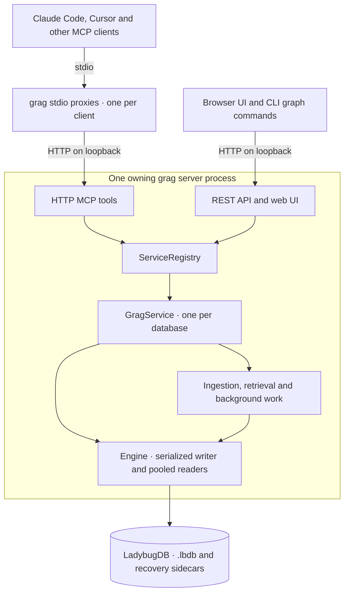

# Architecture

grag is a local graph memory layer for an agent harness. It stores code structure,
documents and authored knowledge, then returns relevant records and connections
with citations. The harness decides what to ask, what to remember and how to
answer the user. grag does not run an LLM or autonomously create a project ontology.

This describes the implementation shipped in [grag 0.9.0](https://github.com/Krokz/grag/tree/v0.9.0).
The usual setup is **one database per checkout, one owning process, and any number
of clients using that process**. BM25 works without an embedding model.

## The usual local setup

`grag init` saves the checkout's database and port in `.grag/project.json` and
configures the harness. Its default stdio proxy starts or connects to a shared
`serve --with-mcp` process. Proxies never open the database. Disconnecting a client
leaves the owner available to the other clients. On Windows, a harness that denies
independent daemon creation requires the printed separate-terminal server command.

| Access mode | Database ownership |
|---|---|
| Init-generated MCP configuration | Each client has a stdio proxy; one shared server owns the file. |
| Browser UI or direct HTTP MCP | Connects to the owning server. |
| CLI `remember`, `search`, `context`, `ingest`, `ingest-code` | Uses a registered owner's REST API, or a configured remote server. Opens a local service only when no owner is selected. A failed server request never falls back to another writer. |
| Direct `grag --db file.lbdb mcp` | The stdio process owns the file; suitable for one client. |
| Python `GragService(config)` | The Python host owns the file and must close the service it creates. It does not automatically attach to another owner. |
| `--db-dir` server | One registry manages separate services/files. Database selectors route requests; there are no cross-database queries. |

Separate checkouts/worktrees get separate identities by default. Sharing a file
is explicit and still requires a single owner. An optional HTTPS deployment uses
the same server and proxy arrangement on another host; there is no separate
distributed database layer. See [projects](guides/projects.md) and
[servers and multiple clients](operations/server.md).

## Responsibilities in the code

| Component | Responsibility and source |
|---|---|
| Setup and routing | [project.py](https://github.com/Krokz/grag/blob/main/src/grag/project.py) resolves the checkout; [admin.py](https://github.com/Krokz/grag/blob/main/src/grag/admin.py) manages registered owners; [client.py](https://github.com/Krokz/grag/blob/main/src/grag/client.py) routes CLI graph operations. |
| Client transports | [proxy.py](https://github.com/Krokz/grag/blob/main/src/grag/proxy.py) bridges stdio and HTTP; [mcp_server/server.py](https://github.com/Krokz/grag/blob/main/src/grag/mcp_server/server.py) exposes tools; [api/main.py](https://github.com/Krokz/grag/blob/main/src/grag/api/main.py) exposes REST and the UI. |
| Shared service | [registry.py](https://github.com/Krokz/grag/blob/main/src/grag/registry.py) reuses one service per resolved database path; [service.py](https://github.com/Krokz/grag/blob/main/src/grag/service.py) handles admission, freshness, bounded operations and shutdown. |
| Storage and mutations | [core/engine.py](https://github.com/Krokz/grag/blob/main/src/grag/core/engine.py) owns connections and transactions; [core/mutations.py](https://github.com/Krokz/grag/blob/main/src/grag/core/mutations.py), [core/evidence.py](https://github.com/Krokz/grag/blob/main/src/grag/core/evidence.py) and [core/revisions.py](https://github.com/Krokz/grag/blob/main/src/grag/core/revisions.py) implement retry receipts, history and edit guards. |
| Ingestion | [ingest/](https://github.com/Krokz/grag/tree/main/src/grag/ingest) selects files, parses supported structures and reconciles generated records while preserving authored evidence. |
| Retrieval | [retrieval/](https://github.com/Krokz/grag/tree/main/src/grag/retrieval) builds lexical/vector candidates, ranks seeds, expands the graph and packs bounded context. |
| Background work | [jobs.py](https://github.com/Krokz/grag/blob/main/src/grag/jobs.py) serializes queued jobs per database; [refresh.py](https://github.com/Krokz/grag/blob/main/src/grag/refresh.py) coordinates source verification; [embedworker.py](https://github.com/Krokz/grag/blob/main/src/grag/embedworker.py) runs optional embedding work. |
| Portability and recovery | [transfer.py](https://github.com/Krokz/grag/blob/main/src/grag/transfer.py) captures/restores logical snapshots; [recovery.py](https://github.com/Krokz/grag/blob/main/src/grag/recovery.py) preserves damaged files and attempts replay on a separate copy. |

## What persists

LadybugDB stores typed node and directed relationship tables. Agents can define
domain-specific labels and keys; there is no mandatory memory vocabulary.
`describe_schema` reports the current schema. Canonical node IDs use `Label:key`,
not native row IDs.

| Data | Lifetime and meaning |
|---|---|
| Authored memories | Facts, decisions, tasks and relationships persist in the selected database. Sources and optional correction history explain where a claim came from. |
| Code structure | Repo, Module, Class, Function and language-specific nodes such as Go Constant and TerraformModuleCall, with supported structural relationships. Stored signatures, docstrings, expressions and citations complement source files; function bodies are not copied into the graph. |
| Documents | Document/Section/Chunk graphs and code mentions, or flat document records. Re-ingestion reconciles loader-owned data; authored relationships remain protected. |
| Edit history and retry receipts | Durable database records. Format-2 logical snapshots preserve them, including receipt replay and portable relationship revisions. |
| Search indexes and vectors | Derived retrieval data. Rebuildable from the stored text and configured embedding policy; logical restore rebuilds these rather than treating them as authored evidence. |
| Jobs and worker counters | Process-local state. A restart loses job records; accepted committed graph changes remain durable. |

The checkout mapping and daemon registrations/logs are filesystem metadata outside
the graph. A `.lbdb` may have WAL and shadow/checkpoint sidecars needed for recovery;
copying only the main file during live writes is not a backup.

## How changes become durable

Schema definition is separate from an authored mutation. An upsert validates its
batch and optional revision guards, then commits nodes, edges, history and the
optional operation receipt together on the serialized writer. Ordinary statement
failure rolls back the batch. An exact retry with the same `operation_id` replays
the original result; it does not undo later edits. Competing revisions require a
reread and reconciliation. See [memory writes](guides/memory.md).

Each engine has one write connection and a reader pool (default maximum: four).
Other threads read committed state while a transaction's own reads use its writer.
Limits bound admitted operations and decoded query work; they are not a hard
process-memory ceiling. LadybugDB 0.20.3 is pinned, with grag's prepared-plan and
native timeout safeguards retained. Ordinary statements default to a cooperative
30-second native limit; commit, rollback and checkpoint finish without that limit.
An uncertain transaction outcome blocks further writes until reopen.

## Ingestion and source freshness

Code ingestion selects the requested roots using `.gitignore`, `.gragignore`,
nested repository/worktree boundaries and size limits. Python uses stdlib `ast`;
the optional `code` extra supplies tree-sitter parsers. Resolution is conservative
static analysis. Coverage diagnostics distinguish supported, unresolved and
omitted constructs; missing edges are not proof of absence.

Parsing happens before the graph transaction. The current incremental mode still
parses the selected files to resolve relationships; content, parser and dependency
changes determine which generated facts need rewriting. There is no persistent
parse-result cache yet. Publication, pruning and successful scope metadata commit
together. Unreadable or partial scans do not certify a complete index.

Serving reads trigger coalesced verification jobs for registered code scopes.
`allow_stale` returns existing evidence while a due check runs; `wait` waits to a
deadline; `require` rejects the read if verification cannot finish. An idle server
does not poll continuously. Freshness certifies the code scope at `checked_at`,
not the truth of memories or completion of embeddings. Document synchronization
is explicit: rerun document ingestion after edits.

Details: [code coverage](guides/code.md), [documents](guides/documents.md) and
[freshness](guides/freshness.md).

## From a question to context

1. For exact structural questions, read-only Cypher projects the needed facts.
   For discovery, search builds BM25 candidates from searchable text tables.
2. With an embedder configured, search also scores vectors. Default `fp32` uses
   exact cosine; optional compressed codecs shortlist candidates and rescore them.
   Native HNSW acceleration remains disabled.
3. Search combines reciprocal ranks and applies label diversity, then expands
   selected seeds through graph relationships. Current-evidence filtering removes
   explicitly obsolete, superseded, retracted, expired and disputed records.
4. Packing returns cited records, connecting edges and selected text under the
   requested budget, with explicit truncation, omissions and paging metadata.

`get_context` starts from known IDs instead of search candidates. Neither path
generates an LLM answer. An exact vector score does not make the overall answer
complete: scope, candidate selection, parser coverage and packing still limit the
evidence. Budgets use a UTF-8 byte estimate, not a model tokenizer guarantee.
See [retrieval](guides/retrieval.md) and [resource limits](reference/limits.md).

## Lifecycle, recovery and trust

The optional embedding worker computes outside the writer lock and only commits
results whose source text and configuration still match. Query embedding still
runs as part of each semantic search. Code verification and
background ingestion share a single job queue per database. Shutdown cancels
queued work and drains accepted operations before closing native connections.
HTTP transport cleanup and application drain have separate bounded waits; work
that outlasts the application grace period keeps the database open until it exits.
A proxy reconnects its MCP session after a restart; an interrupted write still
needs receipt replay or stored-state inspection, not a guessed new write.

Online export captures one committed state into a completed spool, then streams
it. Restore validates and strictly reopens a new destination before publication.
Recovery of an unreadable database preserves original files and works on copies;
partial replay requires an explicit choice. See [backup and recovery](operations/recovery.md).

Storage and retrieval are local by default. First-use extensions, grammars and
optional models can need downloads; `doctor --prepare` prepares those assets.
The harness may send retrieved context to its model provider, and an explicitly
remote embedder sends embedding input to its configured endpoint. Shared HTTP
uses a bearer token when configured and requires one beyond loopback. Database
selectors and caller-supplied evidence actors are not per-user authorization.
See [installation](installation.md) and [server security](operations/server.md).
