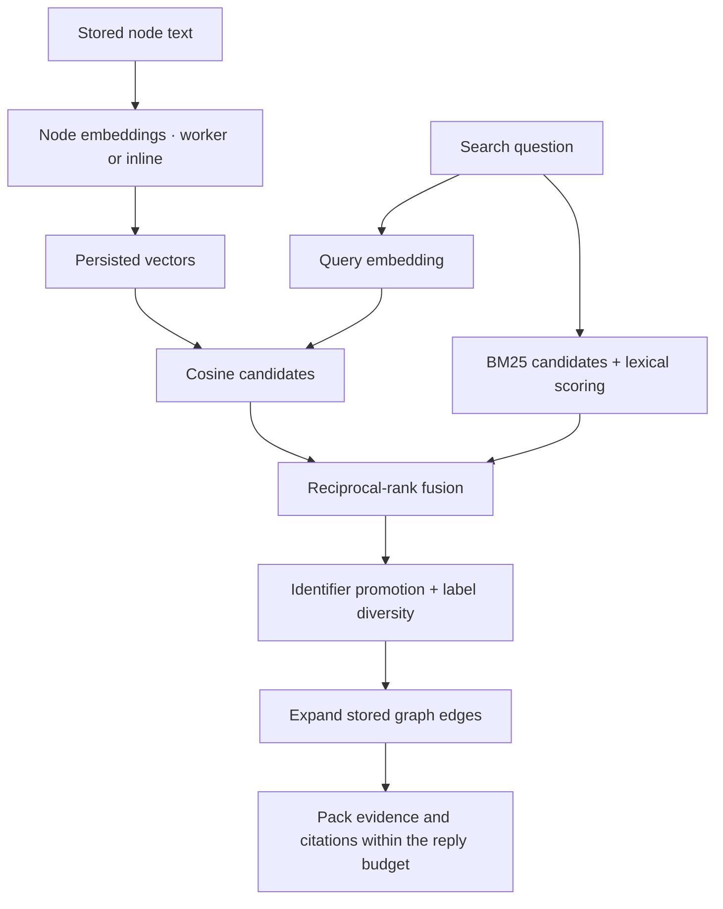

# Embeddings and semantic search

Use FastEmbed to find related code, documents and memories even when your question
uses different words from the stored text.
{ .grag-lead }

Embeddings add a semantic retrieval path to grag's existing full-text search.
They use the same graph, citations and MCP tools. This guide covers local setup,
everyday use, observability, remote providers and the implementation details.

[Set up FastEmbed](#enable-a-local-model) · [Check it is working](#verify-the-active-server) ·
[How retrieval works](#how-hybrid-retrieval-works) ·
[All settings](../reference/configuration.md#optional-embeddings)

## What embeddings add

An embedding model converts text into a fixed-length list of numbers, a **vector**.
grag stores a vector for each indexed node's selected text properties. At search
time, it embeds your question and finds nearby vectors using cosine similarity.
The model's learned representation can connect related descriptions that share
few literal words.

For example, a saved decision might say “retain the previous value when updating
a record.” A later question about “preserving correction history” may benefit
from semantic matching. A query for a known identifier such as `content_revision`
also benefits from lexical matching. grag combines both routes in **hybrid search**;
enabling embeddings keeps the lexical route active.

| Your task | What embeddings can contribute |
|---|---|
| Recall an earlier decision in different words | Find related saved explanations without remembering their exact phrasing. |
| Navigate unfamiliar code | Match a behavior question to stored names, signatures and docstrings. Source bodies still need source reads. |
| Find a relevant document passage | Match the question to indexed section or chunk text. |
| Follow callers or relationships from a known node | Use `get_context`; graph traversal follows stored edges and does not need a semantic query. |

Embeddings do not create memories, infer missing graph edges, or establish that a
claim is true. grag's code index does not copy function bodies into the graph;
semantic retrieval can only compare text that was actually indexed or saved.
Your agent still chooses when to search, inspect sources and save knowledge.

The default installation runs BM25 full-text search without an embedding model.
For semantic retrieval, choose local FastEmbed or a configured remote embedding
endpoint. No separate vector database or generative LLM is required by grag.

## Enable a local model

The local default is `BAAI/bge-small-en-v1.5`, with **384 dimensions**, running
through FastEmbed and ONNX Runtime. Install the extra in the environment that
provides your `grag` command. For a new installation:

=== "pipx"

    ```bash
    pipx install 'gragdb[code,embed-local]'
    ```

=== "uv"

    ```bash
    uv tool install 'gragdb[code,embed-local]'
    ```

=== "pip"

    ```bash
    pip install 'gragdb[code,embed-local]'
    ```

`code` adds non-Python source parsers; use `[embed-local]` alone if you do not
need them. For an existing installation, retain your other extras when upgrading
or reinstalling with `embed-local`. Installing FastEmbed in an unrelated project
virtual environment does not add it to a pipx or uv tool installation.

From the checkout whose graph you want to use:

```bash
grag init --dry-run
grag init
grag status --json
```

When `embed-local` is installed, a later ordinary `grag init` writes
`GRAG_EMBED_PROVIDER=fastembed` into its MCP configuration. Preview that change
with `grag init --dry-run`. Reconnect your MCP client after setup. An already
running owner keeps its previous settings: disconnect its clients, run
`grag stop`, then reconnect so the saved launcher starts the owner with the new
environment. All clients of that graph share the owner's embedding settings.

Custom model, dimension, cache and thread settings must also reach that owner.
Set them in the saved MCP launch environment or the environment of a manually
started server. `init` automatically writes the provider choice; it does not
persist every environment variable from the terminal that ran it. A CLI search
attached to an existing owner cannot reconfigure it through a local environment
variable. See [server ownership](../operations/server.md).

The `init --ingest-if-empty` path in 0.10.0 skips this package-based
selection. It uses any already configured provider; a bare first-use invocation
does not enable one just because FastEmbed is installed.

!!! tip "Using a development checkout"
    Install `pip install -e '.[code,embed-local]'` from grag's source checkout in
    your chosen persistent environment. Use that environment's `grag` command
    for setup. Check the imported source and saved launch command with
    `grag status --json`; a matching version number alone does not distinguish
    your local changes from a published pip/pipx installation.

## Prepare for offline use

First use may download model assets; later loads use the cache. Prepare them
explicitly with the same model/cache settings and operating-system user as your
server:

=== "macOS / Linux"

    ```bash
    GRAG_EMBED_PROVIDER=fastembed grag doctor --prepare
    GRAG_EMBED_PROVIDER=fastembed grag doctor
    ```

=== "PowerShell"

    ```powershell
    $env:GRAG_EMBED_PROVIDER = "fastembed"
    grag doctor --prepare
    grag doctor
    ```

`--prepare` permits asset downloads; plain `doctor` checks cached assets and runs
real local inference without downloading. Neither opens your project graph.
Doctor tests its own command environment, not the settings of a running owner.
It does not install missing Python extras or test a remote embedding endpoint.

Set `FASTEMBED_CACHE_PATH` in both environments if you want a persistent writable
cache instead of FastEmbed's default temporary cache. An existing directory is
not proof that the model can load. grag tries a cached load first; normal use may
download missing assets, while `HF_HUB_OFFLINE=1` prevents that fallback. Local
inference uses ONNX Runtime without PyTorch. See [offline readiness](../installation.md#first-use-downloads-and-offline-use).

## Use it in everyday work

Index your intended [code](code.md) or [documents](documents.md), or
[save a memory](memory.md). Existing stored text can acquire embeddings without
re-ingesting the original sources. With the owner configured, use the normal
search interface; there is no separate “semantic search” MCP tool to activate.

For a project that has saved `Decision` and `Insight` records, ask your agent:

> Use grag to find why we retain earlier values during corrections. Search the
> saved decisions and findings, include sources, and report any incomplete
> indexing or retrieval status.

The corresponding `search_knowledge` arguments might be:

```json
{
  "query": "why retain earlier values during corrections",
  "labels": ["Decision", "Insight"],
  "top_k": 4,
  "hops": 0,
  "token_budget": 2000
}
```

Use labels that exist in your graph; grag has no required memory schema. The CLI
uses the same search service:

```bash
grag search "why retain earlier values during corrections" \
  --label Decision --label Insight --hops 0 --tokens 2000 --json
```

Once you have an ID, use `get_context` to read that record or its relationships.
Across sessions, keep using the same project's database and save useful decisions
with their qualifications and sources. Embeddings make saved text searchable;
they do not automatically capture a conversation. See the
[memory workflow](memory.md) and [retrieval guide](retrieval.md) for correction,
freshness, evidence visibility and budget controls.

## Verify the active server

Start with `grag status --json` to identify the command, imported source, saved
client registration, database and owner. Check the owner's log and its Health
view, or `/api/health` at the server address reported by status. For a selected
database on a multi-db server, use `/api/index/status` with that database selector;
health describes the default database. See [diagnostics](../operations/diagnostics.md).

| Signal | Meaning |
|---|---|
| `vector_status: "off"` in a non-empty-query JSON reply; `vector: "off"` in the MCP footer | This owner has no embedder configured. A zero pending count here does not mean vectors are ready. |
| `vector_status: "error"` / `vector: "error"` | Vector retrieval failed and this call fell back to lexical search. Read the owner log for the cause. Resource-limit failures propagate as errors instead of this fallback. |
| JSON `vector_status: null`, no MCP `vector` warning | No vector-path failure was reported. For a non-empty query over existing tables, the configured vector path ran; this is not a relevance score. |
| `pending_embeddings > 0` | Some nodes in the searched tables still need vectors. Retrieval is using incomplete vector coverage. |
| `embedding.running`, `idle`, `embedded_total`, `passes`, `last_error` | Worker state and process-local progress counters. `running` alone does not mean the backlog is complete; inspect `idle` and `last_error` too. |
| A seed's `match: "vector"` or `"fts"` | The modality with the better rank for that seed; FTS wins ties. There is no `"hybrid"` match label. A hybrid search can return only FTS-tagged seeds. |

The health `embedding` field is `null` when no worker is attached, including
inline embedding mode; it is not an independent provider check. Treat readiness
as several checks together: the intended runtime and owner, working model assets,
no vector error, and no pending nodes in the scope being evaluated. A zero pending
count does not certify source freshness, graph completeness or answer correctness.

## Background work and latency

With embeddings enabled, serving processes normally run a background worker for
stored-node vectors. New or invalidated nodes become pending; the worker embeds
them in batches. Search embeds its query on the request path and uses the vectors
already available, reporting pending work while the worker drains.

`GRAG_EMBED_BACKGROUND=0` selects inline work. Without an attached worker, a search
embeds at most `GRAG_MAX_EMBED_PER_SEARCH` nodes across its searched tables
(default **256**). An ingest performed by a one-shot local service embeds its
writes synchronously. CLI ingests routed to an existing serving owner use that
owner's worker/configuration instead.

The local embedder is cached within a process. FastEmbed inference uses at most
four CPU threads by default, or `GRAG_EMBED_THREADS` when set to a positive value.
Calls are serialized within the local embedder, so worker batches and query
inference share its capacity. Model loading, initial indexing and steady-state
query latency are separate costs.

### What gets reused across sessions

Stored node vectors persist in the database. Reconnecting an agent or restarting
the owner does not require re-embedding unchanged text under the same policy,
although a new owner must load its model. New or changed text needs new vectors;
each semantic search still embeds its question and scans candidates.

This lets initial indexing work be shared across later tasks. The possible agent
benefit comes from finding a useful saved explanation or source sooner and avoiding
repeated investigation. More sessions alone do not guarantee that benefit: the
graph must contain relevant evidence, retrieval must deliver it, and the agent
must use it. See [measuring usefulness and cost](#measure-usefulness-and-cost).

## How hybrid retrieval works



1. **Discover candidates.** Each searched label contributes a bounded lexical
   shortlist and, when enabled, a vector shortlist. At the default `top_k=8`, the
   quota is normally 32 per label and modality, reduced when needed to respect
   the global 1,024-candidate limit per modality. Eligible evidence is selected
   under the request's lifecycle policy.
2. **Combine ranks.** grag applies shared lexical scoring to the FTS candidates
   and combines lexical and vector ranks using reciprocal-rank fusion:
   `score = sum(1 / (60 + rank))`. Equal modality scores share a rank; duplicate
   nodes contribute once per modality. This combines orders rather than comparing
   raw BM25 and cosine scores directly.
3. **Select and expand.** The bounded exact-identifier rule can promote matches,
   label diversity gives other labels a turn, and selected seeds expand through
   existing graph edges up to `hops`. See [selection details](retrieval.md#how-search-ranks-and-expands).
4. **Deliver evidence.** The packer selects records, properties and citations
   within the response budget. A node reaching the candidate pool, or even the
   seed list, does not guarantee its decisive text survives packing. Vector
   payloads themselves are omitted from retrieved context.

An embedding model therefore improves one part of the pipeline. It cannot rescue
an unindexed fact, manufacture an absent relationship, or guarantee that fusion
and packing deliver the best evidence. This path has no generative summary step
or cross-encoder reranker.

## Embedding inputs and invalidation

### Which text becomes a vector

grag selects a node's non-internal `STRING` properties, excluding vector fields.
By default it leaves out `meta`, `path`, `heading_path`, `code_coverage`, `language`,
`git_commit`, `git_branch` and `ingested_at`. Those fields remain available to
full-text search and ordinary reads. Selected non-null values are joined with
newlines, then embedded as one text for that node.

`GRAG_EMBED_EXCLUDE_PROPS` replaces the exclusion list. Python users can select
fields per label through `EmbedderConfig.text_props`:

```python
from grag.config import EmbedderConfig, GragConfig

config = GragConfig(
    db_path="knowledge.lbdb",
    embedder=EmbedderConfig(
        provider="fastembed",
        model="BAAI/bge-small-en-v1.5",
        dim=384,
        text_props={"Function": ["name", "signature", "docstring"]},
    ),
)
```

This constructs a library configuration; it does not update a running server.
`GragConfig(...)` does not read environment settings unless you explicitly use
`GragConfig.from_env()`. See [Python usage](../reference/python-rest.md).

Only existing `STRING` fields qualify. If an explicit field list selects nothing,
grag falls back to its default selection; if exclusions leave no fields, it falls
back to all eligible `STRING` fields. If a node has no non-null selected values,
its key is used. These are retrieval settings, not a strict data-redaction boundary.

### Query and document prefixes

grag prepends model-family retrieval prefixes before inference:

| Model name contains | Query prefix | Node-text prefix |
|---|---|---|
| `bge-m3` | none | none |
| `bge-`, `arctic-embed`, `mxbai-embed` | `Represent this sentence for searching relevant passages: ` | none |
| `nomic-embed` | `search_query: ` | `search_document: ` |
| `e5-` | `query: ` | `passage: ` |
| No recognized family | none | none |

`GRAG_EMBED_QUERY_PREFIX` and `GRAG_EMBED_DOC_PREFIX` override these defaults.
An unset value selects the family rule; an empty string disables that prefix.
For another model, verify its input convention and output dimension before use.

### Changes and rebuilding

Vector columns are added lazily. Each node stores its full-precision vector,
codec data, model ID and a configuration fingerprint. A change to model, endpoint,
prefixes, effective text fields or codec makes incompatible vectors pending for
rebuilding. Legacy vectors without a fingerprint rebuild once. Text edits also
invalidate derived vectors; an in-flight result is discarded if its source text
or embedding configuration changed before the write could commit.

When you need to rebuild immediately, or a remote model changed behind the same
name and endpoint, run `grag reindex` with the intended embedding configuration.
This command opens the database directly: disconnect auto-starting clients and
stop its owner first. From the selected project, for the default local model:

```bash
grag stop
GRAG_EMBED_PROVIDER=fastembed grag reindex --batch-size 128
```

In PowerShell, set `$env:GRAG_EMBED_PROVIDER = "fastembed"` before `grag reindex`.
For a custom model, supply the same model, dimension and other settings the owner
will use after reconnecting. Reindex regenerates vectors from stored text;
it does not re-ingest source files or create missing content.

`GRAG_EMBED_DIM` must match both the model output and the existing vector column.
Changing dimensions is not an automatic resize: grag reports a mismatch without
dropping data. Use an explicit storage migration or a separate database restored
from a [logical snapshot](../operations/recovery.md) with the new configuration.

## Use a remote embedding endpoint

The `remote` provider accepts an OpenAI-compatible embeddings API. Install
`gragdb[embed-remote]` in the server's environment, then configure these settings
on the owner:

| Setting | Example or requirement |
|---|---|
| `GRAG_EMBED_PROVIDER` | `remote` |
| `GRAG_EMBED_BASE_URL` | `https://embeddings.example.com/v1` — replace with your endpoint root; grag appends `/embeddings`. |
| `GRAG_EMBED_MODEL` | A model ID your endpoint supports. |
| `GRAG_EMBED_DIM` | That model's actual output width. |
| `GRAG_EMBED_API_KEY_ENV` | Optional name of the variable holding the bearer key, such as `EMBEDDING_API_KEY`; not the key itself. |

grag sends `{"model": "...", "input": ["..."]}` by HTTP POST and reads vectors
from `data[].embedding`, ordered by `data[].index`. The same text selection,
prefixes, fusion and packing apply. Doctor reports remote configuration but does
not send a test embedding request; normal indexing or search invokes the service.

Local FastEmbed performs text inference on your machine after model preparation.
A remote provider sends selected node text and search questions to that endpoint,
which may charge for them. In either mode, the agent harness may send the
retrieved evidence to its own model provider. Changing embedding providers does
not change that harness behavior.

## Vector codecs and crash safety

`fp32` is the default and uses full-precision cosine scoring. `int8`, `binary`
and `polar` use compact direction codes to select candidates, then exactly
rescore a shortlist against the retained fp32 vectors. Select a codec with
`GRAG_VECTOR_CODEC` or `GragConfig.vector_codec`.

Example `grag bench` run with grag 0.9.0 / LadybugDB 0.20.3 on macOS arm64:
1,500 synthetic documents, 64 dimensions, seed 7 and 50 queries. This measures
vector-neighbor recall against exact fp32 ground truth, not answer quality.

| codec | candidate bytes/vec (dim 64) | recall@10 | note |
|---|---|---|---|
| `fp32` | 256 | 1.000 | baseline; full-precision cosine scoring |
| `int8` | 68 | 0.998 | compact code scan + fp32 rescore |
| `binary` | 8 | 0.474 | hamming scan + fp32 rescore |
| `polar` | 14 | 0.762 | experimental PolarQuant-style angular codes (sine-power-law bit allocation, training-free) |

The byte column describes candidate codes, not total database storage. Compressed
codecs retain full-precision vectors for rescoring. Run the benchmark on your
runtime for current results; these synthetic scores do not establish real-project
retrieval quality or a memory/latency guarantee.

Compressed-code candidate generation scans all eligible rows, fetching keys and
codes before retrieving fp32 vectors for a rescore shortlist. It is an approximate
scan, not an approximate-nearest-neighbor (ANN) index. Exact rescoring cannot recover
a useful vector excluded from that shortlist.

### Native index policy

Full-precision (`fp32`) retrieval uses an exact cosine scan, also O(rows × dimensions),
with full records fetched only for the shortlist. Native HNSW acceleration remains
disabled after the LadybugDB 0.20.2 indexed-embedding crash. The 0.20.3 engine
includes upstream index fixes; grag retains exact cosine and its existing safety
policy while broader acceleration validation remains separate. On writable open,
grag removes its legacy `grag_vec__*`
indexes, checkpoints and reopens before serving; graph data and stored vectors
are preserved. This also applies when embeddings are disabled. Read-only
inspection leaves indexes intact; externally managed HNSW indexes require their
owner to remove them before grag accepts writes. An already unreadable WAL still
requires the separate `grag recover` workflow. Search may be slower on large
graphs, but semantic search, codecs, and the embedding model settings remain available.

## Measure usefulness and cost

Use questions and tasks from your own project, including natural-language recall,
exact symbols, ambiguous names and cases where tests or documents are the decisive
evidence. Keep the graph snapshot, model, candidate settings and reply budget fixed
when comparing retrieval changes. Record readiness and the actual owner/runtime so
a supposed hybrid run cannot silently be a BM25-only run.

There are three different measurements:

| Measurement | What it tells you |
|---|---|
| Candidate or seed hit rate | Whether retrieval found an expected node. It may still lack the needed text. |
| Evidence delivered within the budget | Whether the agent received the decisive content and citations. |
| Cost per accepted task across sessions | Whether the agent completed correct work with less total investigation, model spend and retry overhead. |

The repository's [embedding evaluation script](https://github.com/Krokz/grag/blob/main/examples/embedding_eval.py)
compares vector-only, FTS-only and hybrid seed hit rates and MRR, alongside embedding
time and vector-query latency. It uses a `grag export` and a question file in fresh
temporary databases. `--auto N` derives proxy questions from indexed document
sections. This is an **any-match seed evaluation**, not a packed-evidence or answer
quality test. Remote candidates make embedding API calls; local candidates use
CPU and may download uncached models.

For agent economy, evaluate repeated work on a persistent graph and record initial
setup separately from later sessions. Include writes, corrections, refresh,
retrieval calls, source reads, failed attempts, latency and the harness's actual
tool-loading and prompt-cache behavior. Report total model/embedding spend divided
by accepted tasks, alongside cumulative cost including setup. Local embedding work
has time and resource costs even without a per-call API charge.

Embeddings do not directly shorten the agent's prompts or eliminate tool-schema
overhead. Savings must come from useful evidence avoiding later work. Better
similarity scores or smaller replies alone do not demonstrate session savings.

## Troubleshoot semantic retrieval

| Symptom | Check or next step |
|---|---|
| FastEmbed installed, but `vector: "off"` | Inspect the saved launch environment and active owner; restart it after configuring the provider. |
| Model cannot load or `vector: "error"` | Read the owner's error, verify the correct extra, model/dimension and cache permissions, then run doctor with matching settings. |
| Pending work does not drain | Inspect the worker's `last_error`; confirm background mode or the inline per-search limit. Avoid treating an incomplete index as an embedder quality result. |
| High first-use latency | Separate asset download, model load, initial node embedding and per-query work. Prepare assets and inspect worker progress. |
| Relevant text is absent despite no pending work | Inspect what was actually ingested, label scope, lifecycle policy, candidate coverage and packed evidence. An absent result does not prove no memory exists. |
| Model/dimension mismatch after a change | Match the model's output width; use an explicit migration or a separate restored database if stored column dimensions differ. |

For implementation details, see
[`vectors.py`](https://github.com/Krokz/grag/blob/main/src/grag/retrieval/vectors.py)
(text policy, providers, storage and cosine retrieval),
[`search.py`](https://github.com/Krokz/grag/blob/main/src/grag/retrieval/search.py)
(fusion and selection), and
[`embedworker.py`](https://github.com/Krokz/grag/blob/main/src/grag/embedworker.py)
(background work). The [configuration reference](../reference/configuration.md#optional-embeddings)
lists every environment variable.
